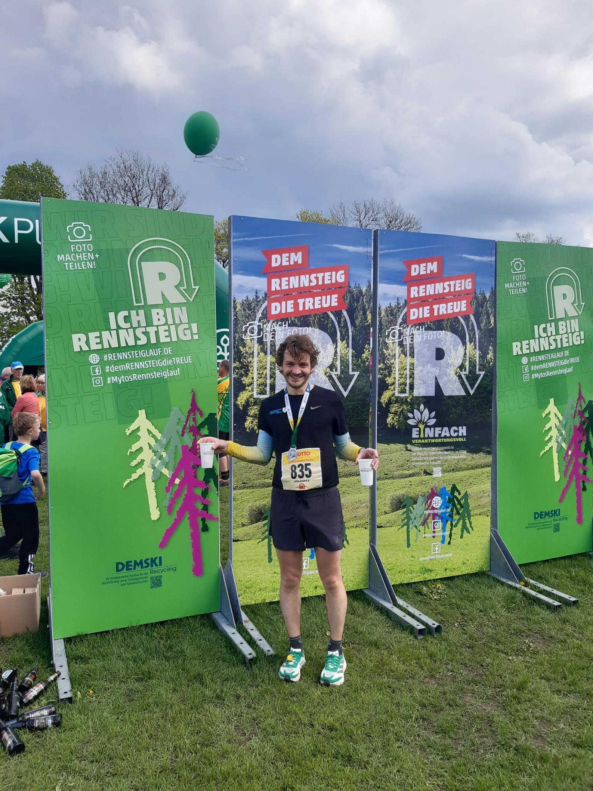
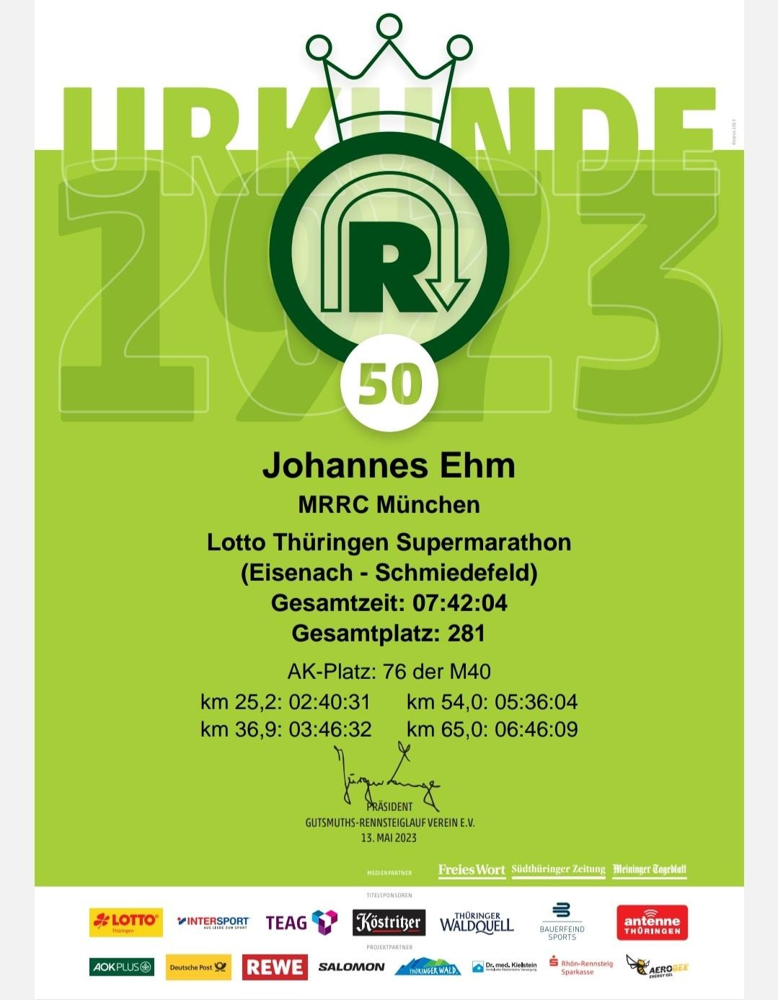

+++
author = "Johannes Ehm"
title = "50. Rennsteig Supermarathon 2023"
date = "2023-05-22"
description = ""
tags = [
	"athletics",
  "marathon",
	"german"
]
draft = false
+++

Das schönste Ziel der Welt liegt in Schmiedefeld. Mit der 50. Auflage in 2023 feierte der Rennsteiglauf im Thüringer Wald dieses Jahr ein großes Jubiläum. Der Rennsteiglauf führt tausende Trailläufer auf verschiedenen Strecken von verschiedenen Starorten nach Schmiedefeld und gehört damit als einer der bekanntesten und größten Trail Laufveranstaltungen auf der Welt zu den Traditionsveranstaltungen im Laufsport schlechthin. Alle Laufstrecken führen über den Rennsteig 170 km entlang des Rückens des Thüringer Waldes. Der Halbmarathon startet in Oberhof und führt in 21,4 km nach Schmiedefeld. Der Marathon startet in Neuhaus und führt in 42,4 km auch nach Schmiedefeld. Und der Supermarathon startet in Eisenach und führt in 73,9 km ebenfalls nach Schmiedefeld ins schönste Ziel der Welt. Am 13.05.2023 habe ich zum ersten Mal am Rennsteiglauf teilgenommen und habe mich gleich für die Strecke - den langen Kanten - von Eisenach nach Schmiedefeld entschieden. Der Supermarathon startet um 6 Uhr auf dem Marktplatz in Eisenach und führt über den Großen Inselsberg (25,2 km), der Ebertswiese (36,9 km), dem Grenzadler in Oberhof (54,0 km) und Schmücke (65 km) nach Schmiedefeld. Die Strecke hat 1867 Höhenmeter im Anstieg wobei man zwischen Oberhof und Schmiedefeld noch gleich den großen Beerberg mitnimmt, der mit 982,9 m die höchste Erhebung des Thüringer Wald und Thüringens ist.

Gespannt entspannt ging es für mich und alle anderen in Eisenach um 6 Uhr früh los. Nach wenigen Metern haben wir Eisenach verlassen, um nach ca. 7 km auf den Rennsteig einzubiegen. Der Frühnebel lag noch in den Tälern, aber schon nach wenigen km gab es wunderschöne Weitblicke über die Täler hinweg in die Ferne, mal in den Süden, mal in den Norden, mal zur Wartburg zurück und mal zum großen Inselsberg. Am großen Inselsberg schon nach 8 Uhr hat mich die Sonne begrüßt, die mich bis ins Ziel in Schmiedefeld begleiten sollte. Der Veranstaltungstag bescherte perfekte Laufbedingungen im ansonsten eher durchwachsenen Mai 2023: Sonne und angenehme Temperaturen knapp unter der 20 Grad Grenze. Der Weg führt überwiegend über Schotterwege aber auch immer wieder über schöne wurzeldurchwachsene Trails. Am Anfang geht es überwiegend hoch, um nach dem großen Inselsberg in ein welliges Terrain zu führen. Die große Ebertswiese zur Halbzeit nach 3 Stunden und 46 Minuten war die Halbzeit aber auch schon die achte Verpflegungstation. Mit nur noch knapp 37 km Reststrecke hatte ich zur Halbzeit das erste Mal ein Gefühl wie weit Schmiedefeld noch entfernt sein könnte: knapp 4 Stunden. Trotzdem musste ich mir kleine Rechentricks zurechtlegen, um die nächste Etappe anzugehen: noch 18 km zum Grenzadler und wenn ich 8 km schaffe, dann sind es nur noch 10 km und vom Grenzadler ist es dann nur noch ein Halbmarathon nach Schmiedefeld und ein Halbmarathon bin ich schon wirklich sehr häufig gelaufen. Das Ergebnis der Rechnung also: Der Rennsteiglauf ist machbar und schaffbar und zum Genießen. Immer wieder habe ich mich über die Zuschauer mitten im Wald gefreut. Bei keinem anderen Marathon musste ich so oft lächeln ob der Anfeuerung, der schönen Ausblicke und der schönen Eindrücke. Nach ca. 50 km kündigte sich langsam Oberhof an und damit die letzte Etappe des Supermarathons. Die ersten 50 km gingen im angenehmen Dauerlauftempo überraschend gut, trotzdem wurden die Kilometer 54 bis 60 schwer und die Kilometer 60 bis 70 sehr schwer. Es war zunehmend schwer Steigungen zu laufen und es gab immer häufiger Passagen, in denen ich gehen musste. Mit weiteren kleinen Tricks habe ich versucht weiterzulaufen: Wenn ich 800 m laufe, dann gönne ich mir 200 m gehen. Am Ende helfen aber selbst nach 65 km keine Motivationstricks gegen die Tatsache, dass die Beine schon 65 km gelaufen sind und ich 6 Stunden und 46 Minuten ohne Pause unterwegs bin. An den letzten Verpflegungstationen traue ich mich ein, zwei Brote zu essen und nicht mehr wie üblich Tee zu trinken, sondern Apfelschorle und Cola. Ich entscheide mich aber weiterhin gegen Schleim, Rostbratwurst und Schwarzbier. Andere entscheiden sich für Schleim und Schwarzbier. Läuferinnen und Läufer mit Rostbratwurst konnte ich nicht entdecken. Die Kilometer 65 bis 70 km sind ultra schwer. Bis hierin habe ich noch überholt, auf diesen letzten Kilometer werde ich überholt, bis zur Rettung: es geht bergab und ich hole langsam die Teilnehmer der offiziellen Rennsteig-Wanderung von Oberhof nach Schmiedefeld ein die jede Läuferin und jeden Läufer frenetisch anfeuern. Plötzlich ist die Strecke gesäumt von Jung und Alt und jeder feuert an und plötzlich erspähe ich die ersten Blicke auf Schmiedefeld und weiß, dass es nicht mehr weit sein kann. Nach Schmiedefeld ins Ziel geht es nur noch bergab, es gibt immer mehr Zuschauer. Wenige hunderte Meter vor dem Ziel erspähe ich meine Freundin, die mir etwas zuruft. Ich bin aber in einer Mischung von Dauerlächeln und Daueranstrengung innerlich versunken, um wenig später auf die Zielgerade einzubiegen um ein Volksfest zu erblicken und um zu wissen: das schönste Ziel der Welt liegt in Schmiedefeld und der Rennsteiglauf ist der schönste Marathon, den ich bisher gelaufen bin.

Split | Km | Tageszeit | Zeit | Diff | min/km | km/h | Platz
-------- | -------- | -------- | -------- | -------- | -------- | -------- | --------
Gr. Inselsberg | 25,2km	| 08:43:14 | 02:40:31 | 02:40:31 | 06:23 | 9.42 | 400
Ebertswiese | 36,9km | 09:49:15 | 03:46:32 | 01:06:01 | 05:39 | 10.63 | 309
Grenzadler | 54,0km | 11:38:47 | 05:36:04 | 01:49:32 | 06:25 | 9.37 | 276
Schmücke | 65km | 12:48:52 | 06:46:09 | 01:10:05 | 06:23 | 9.42 | 259
Ziel | 73,9km | 13:44:47 | 07:42:04 | 55:55 | 06:17 | 9.55 | 282


<iframe src="https://www.komoot.de/tour/1116385656/embed?profile=1" width="100%" height="700" frameborder="0" scrolling="no"></iframe>

