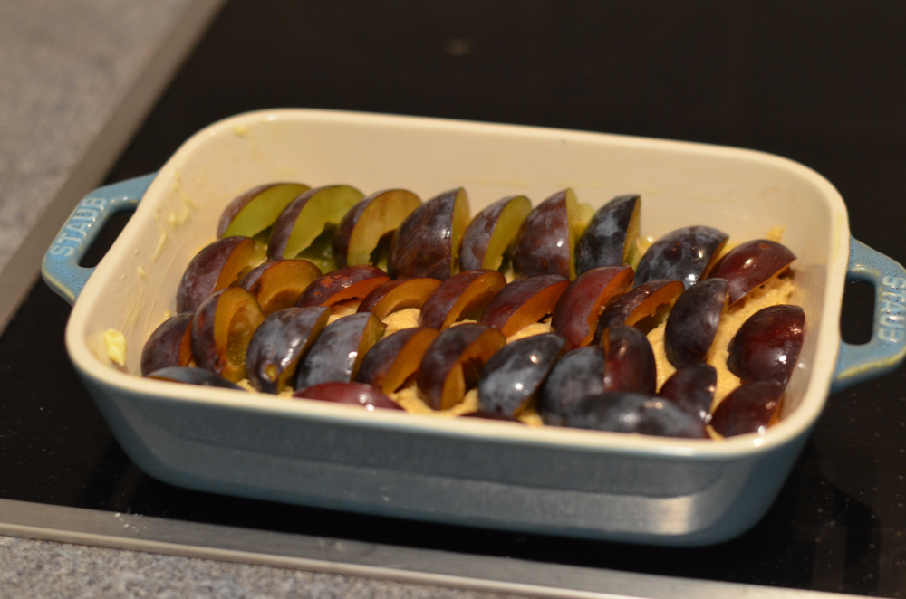
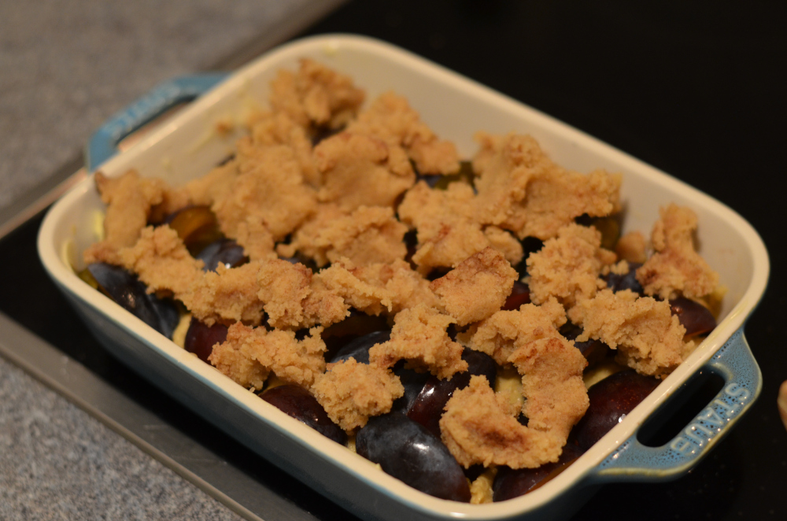
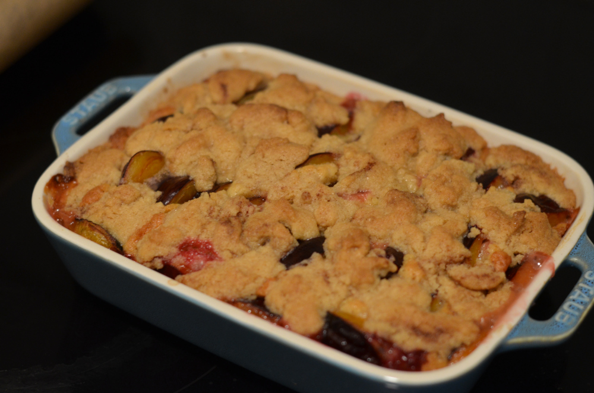

+++
author = "Johannes Ehm"
title = "Pflaumenkuchen"
date = "2022-09-05"
description = "Herbstzeit ist Pflaumenkuchenzeit"
tags = [
	"baking",
	"backend",
	"cake",
	"kuchen",
	"pflaumen",
	"german"
]
+++

Der September ist die ideale Zeit um einen Pflaumenkuchen zu backen. Ich hatte das große Glücke eine Lieferung frischer Pflaumen direkt aus einem ländlichen Garten zu bekommen. In Bayern nennt man einen Pflaumenkuchen Zwetschgendatschi. Datschi könnte eine wunderbare Anspielung auf den fruchtigen weichen Geschmack der Pflaumen in einem cremigen Teig bestückt mit knusprigen Streusel. In Wirklichkeit bedeutet Datschi wohl das [Drücken der Pflaume in den Teig](https://de.wikipedia.org/wiki/Zwetschgenkuchen#:~:text=Das%20Wort%20%E2%80%9EDatschi%E2%80%9C%20leitet%20sich,M%C3%BCrbteig%20und%20ohne%20Streusel%20gebacken). Auch mit dieser Bedeutung bin ich zufrieden, da das Zubereiten eines Pflaumenkuchens oder Zwetschgendatschis ein wirklich wunderbar zufriedenstellender Vorgang ist. Während bei mir beim Brot backen die Wahrscheinlichkeit hoch ist, dass der Teig etwas anderes macht als das was ich im Sinn habe, ist bei einem Pflaumenkuchen oder Zwetschgendatschi einfach garantiert, dass das Ergebnis wunderbar wird - egal [ob Hefe- oder Rührteig](https://www.youtube.com/watch?v=ZxAo5Sk8Iz4&ab_channel=BayerischerRundfunk).

## Rezept

Ich habe mich dieses Mal für einen Rührteig entschieden frei nach einem [Rezept von cinnamonandcoriander.com](https://cinnamonandcoriander.com/de/pflaumenkuchen-mit-streusel-vom-blech-schnell-einfach/).

### Zutaten

Teig:

- 300 Gramm Zwtschgen
- 60 g Butter
- 50 g brauner Zucker
- eine halbe Packung Vanillezucker
- 2 Eier
- 90 g Mehl
- 1 TL Backpulver
- Butter für die Form

Streusel:

- 50 g Zucker
- 1 TL Zimt
- 50 g Butter
- 90 g Mehl

1. Für die Streusel Zucker, Zimt und Butter miteinander vermischen und kneten. Mehl hinzugeben und weiter kneten, so dass schöne Streusel entstehen. Streusel in den Kühlschrank stellen und in der Zwischenzeit den Teig herstellen.

2. Für den Teig Butter, Zucker und Vanillezucker miteinander vermischen. Eier hinzugeben und weiter schlagen. Mehl und Backpulver hinzugeben und kurz schaumig schlagen. Teig in eine gebutterte Form geben und Zwetschgen in den Teig drücken.

3. Zwetschgen im Teig mit Streusel bestreuen.

4. Kuchen in den Ofen geben und mindestens 30 Grad bei 180 Grad backen.

## Korrektur

Zwetschgen sind eine Unterart der Pflaume. Weiterhin habe ich einen Rührteig gemacht. In früheren Versionen dieses Textes habe ich stellenweise geschrieben, dass ich einen Mürbeteig gemacht habe.
