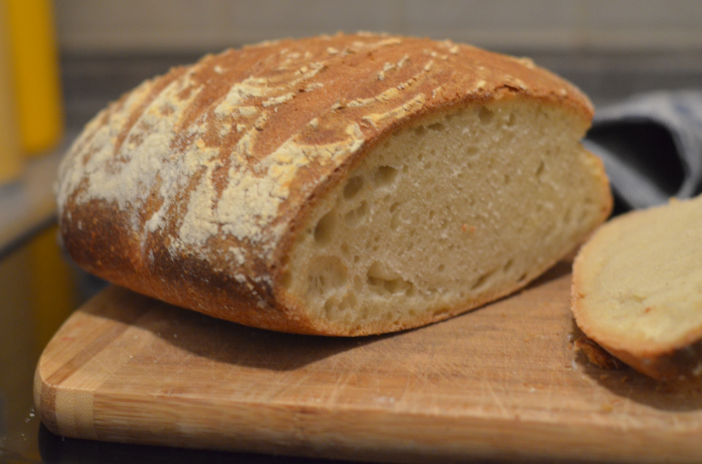
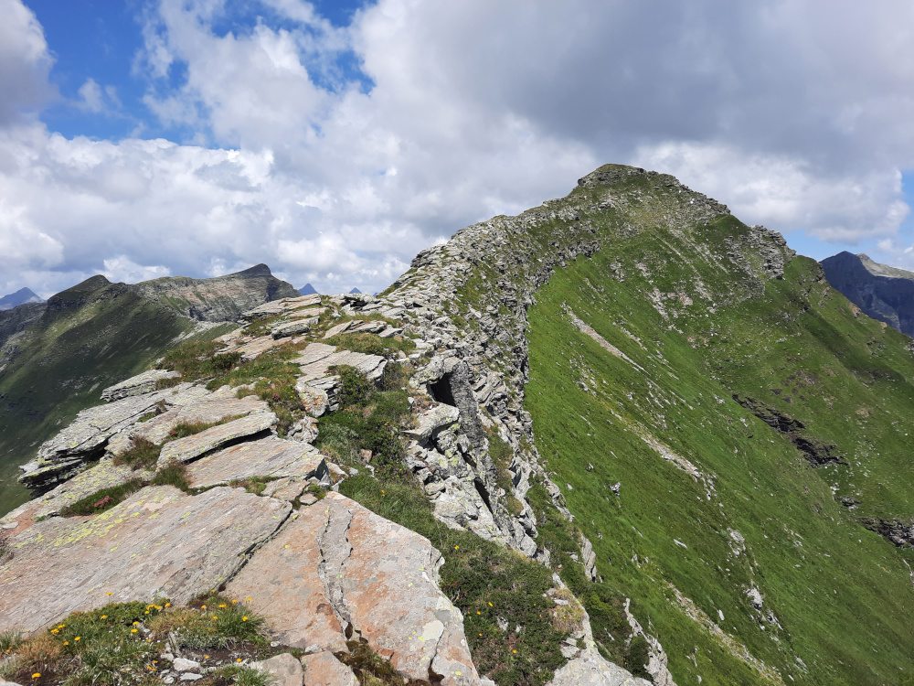
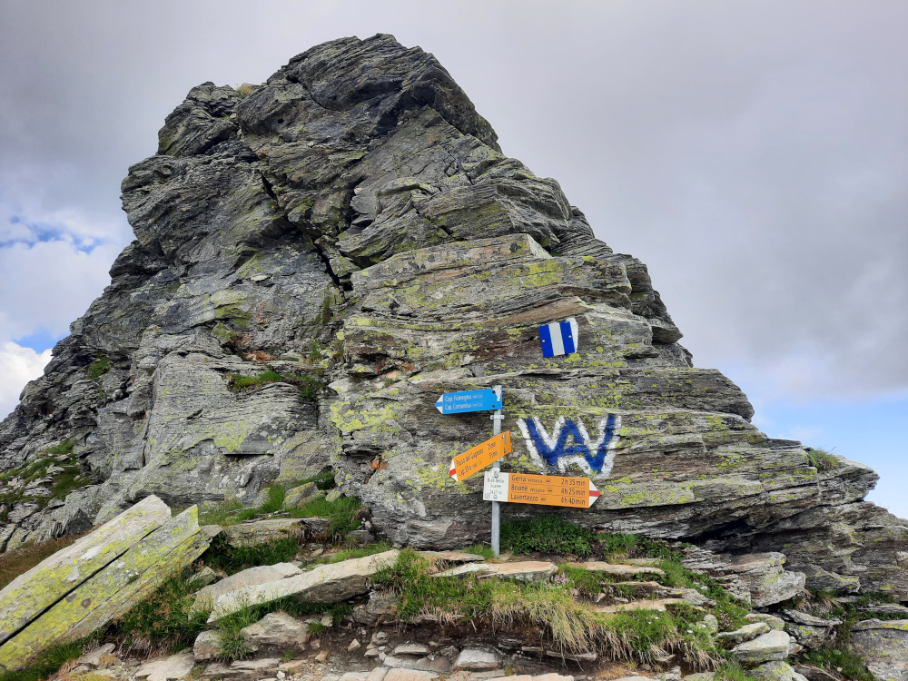
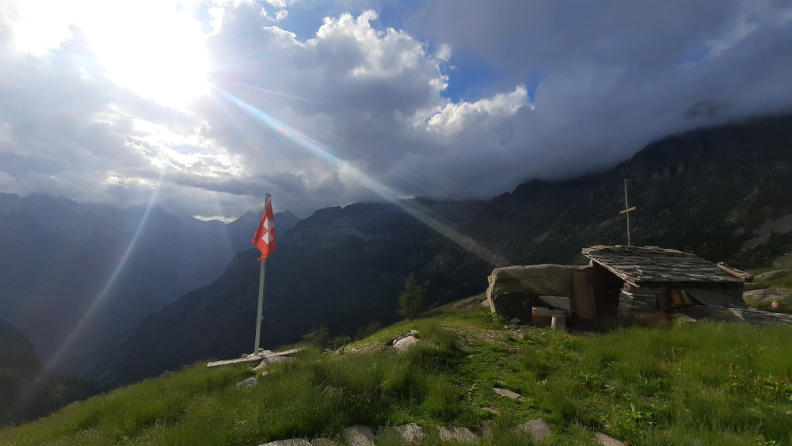
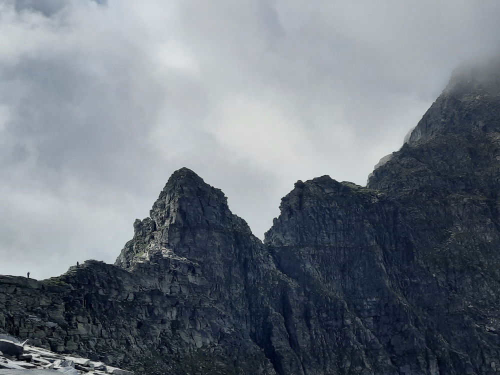

+++
author = "Johannes Ehm"
title = "Panne Valle Maggia"
date = "2022-10-12"
description = "Panne Valle Maggia"
tags = [
	"baking",
	"backend",
	"bread",
	"brot",
	"bergkruste",
	"german",
	"valle maggia",
	"Valle verzasca",
]
+++

Letzte Woche habe ich einen Ausflug in das Tessin gemacht und das Panne Valle Magia aus dem [Almbackbuch](https://www.brotbackbuch.de/almbackbuch/buch/) gebacken. Das Rezept gibt es ähnlich auch als [Pane Valle Maggia (Neuauflage)](https://www.ploetzblog.de/2020/05/09/pane-valle-maggia-neuauflage/) auf dem [Plötzblogs](https://www.ploetzblog.de/). Das Brot trägt den Namen des Maggia Tals im Tessin. Wahrscheinlich hat der Name Maggia einen starken Reiz auf mich ausgeübt. Erst dieses Jahr haben wir eine Hüttentür im Nachbartal des Maggia Tals gemacht: Valle Verzasca. Eine Wanderung im Valle Verzasca ist eine einsame Gratwanderung mit ausgesetzten Passagen, hohen Gipfel und einsamen hervorragend ausgestatteten Selbstversorgerhütten des Schweizer Alpenvereins. Ein Highlight war der schwierige Abstieg vom Berg mit dem wunderschönen Nmaen Madom Gröss weiter zum Talschluss des Valle Verzasca. Im Talschluss hat eine wunderschöne Flora mit selten und vielfältigen Blumen und Pflanzen auf uns gewartet. Ein unerwartetes großes Highlight im Schweizer Tessin dieses Valle Versacza als Nachbartal des Valle Maggias. Aber zurück zum Backen. Dieses mal war ich mit dem Teig zufrieden. Ich habe deutlich weniger Wasser wie im Rezept angegeben verwendet. Ich habe die Zeiten der Stock- und Stückgare eingehalten. Obwohl geschmacklich gut hätte ich mir gewünscht, dass ich eine bessere Lockerung der Krume hinbekommen hätte. Das Brot ist sehr schnell getrocknet, wohl ein Nebeneffekt davon, dass ich sehr sparsam Wasser zugegeben haben. Ein Experiment, dass unbedingt wiederholt werden muss um an einer besseren Lockerung zu arbeiten.

