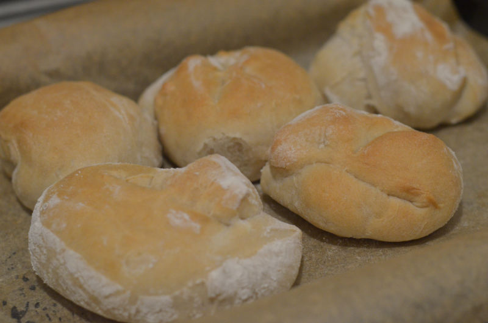
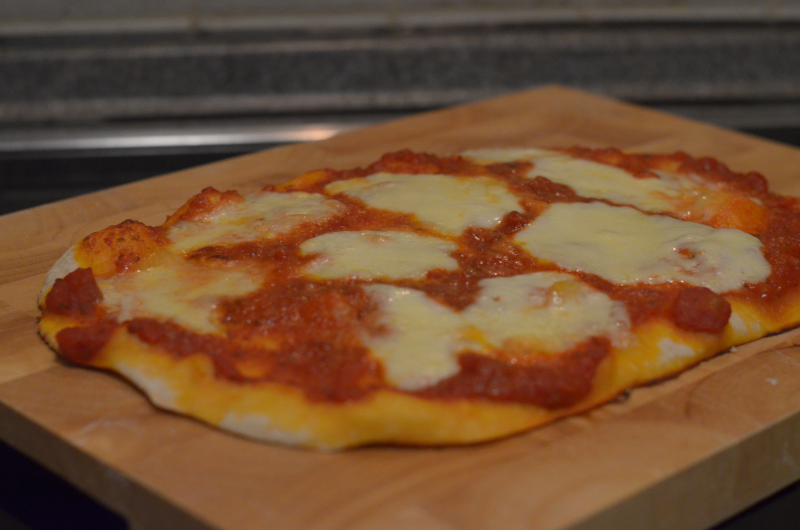

+++
author = "Johannes Ehm"
title = "Brötchen und Pizza"
date = "2022-10-25"
description = "Brötchen und Pizza"
tags = [
	"baking",
	"backend",
	"bread",
	"brot",
	"brötchen",
	"pizza",
	"german"
]
+++

Meine Hüttensemmeln und meine Hüttenpizza aus dem [Almbackbuch](https://www.brotbackbuch.de/almbackbuch/buch/) sind zwei äußerst gelungene Backprojekte. Die Hüttensemmeln habe ich gleich drei mal hintereinander gebacken, um das Rezept zu verfeinern und meine Handfertigkeit bei der Zubereitung der Semmeln zu trainieren. Das Grundrezept besteht hauptsächlich aus Weizenmehl 550 und Hefe mit zwei Vorteigen. Bei der dritten Zubereitung habe ich die Hefe um etwas Weizensauerteig ergänzt, der den Brötchen einen zusätzliches vielschichtiges Aroma gegeben hat. Das Rezept ist sehr einfach und ich finde, dass Weizenteig auch immer ein sehr dankbar zu bearbeitender Teig ist. Das Rezept ist unter der Überschrift [Alm-Rezepte: Hüttensemmeln (& Focaccia)](https://www.ploetzblog.de/2016/09/10/alm-rezepte-huettensemmeln-focaccia/) auch auf dem [Plötzblogs](https://www.ploetzblog.de/) zu finden. Ebenso findet man dort das Rezept der [HÜttenpizza](https://www.ploetzblog.de/2018/08/18/huettenpizza/). Ich kann wirklich unterstreichen, dass es ein wirklich hervorragender Pizzateig ist. Ich habe den Teig wie angegben lange reifen lassen und anschließend bei 250 Grad im Elektroofen gebacken. Ich hätte den Teig etwas länger backen sollen. Trotzdem ist die Pizza Margharita auf Basis der Hüttenpizza hervorragend gelungen und ich weiß nicht wirklich wie ansonsten die Zubereitung noch schief gehen könnte. Es handelt sich um ein Rezept, das gut gelingen muss und etwas hervor bringt wie man es zu Hause eigentlich nicht gewöhnt ist. Einige Tage später habe ich eine schnelle Pizza auch auf Basis von Sauerteig und Hefe gemacht und den Teig nur ganz kurz reifen lassen. Das Ergebnis lässt sich nicht vergleichen und man meint zwei Pizzen aus zwei unterschiedlichen Welten zu haben. Der bessere Teig ist nicht schwieriger zuzubereiten, sondern hatte einfach mit weniger Hefe und etwas mehr Sauerteig einfach mehr Zeit sich zu entwickeln. Mit diesem Erlebnis ist mir eigentlich erst richtig klar geworden, wie wichtig ein guter Teig für eine gute Pizza entscheident ist und hat mich angeregt bei Pizzen noch stärker auf den Geschmack des Teiges zu achten. Beide Rezepte bekommten eine ganz klare Empfehlung! Wenn nur noch noch meine Fotos so aussehen wie das geschmackliche Ergebnis, dann wäre es perfekt.

