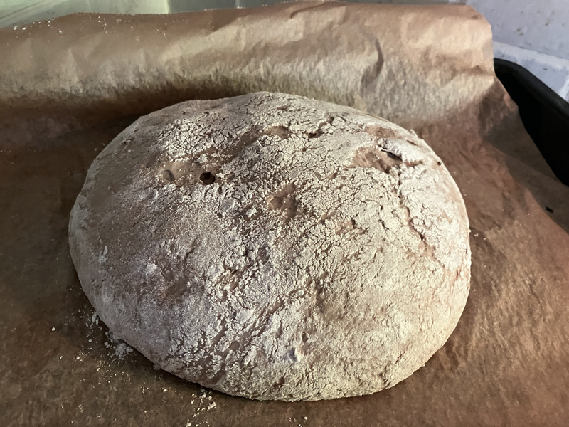
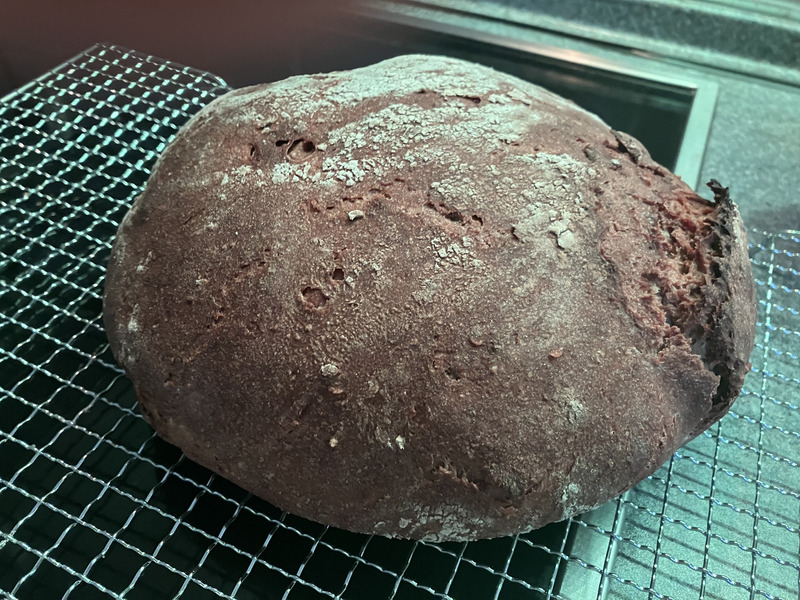

+++
author = "Johannes Ehm"
title = "Roggenmischbrot"
date = "2022-11-24"
description = "Roggenmischbrot"
tags = [
	"baking",
	"backend",
	"bread",
	"brot",
	"roggenmischbrot",
	"german"
]
draft = false
+++

Unmittelbar nach einem langen Urlaub habe ich mich an das Rezept [Roggenmischbrot nach Art des Sappelbrotes der Bäckerrei Schüller aus Bamberg](https://www.ploetzblog.de/2022/11/12/roggenmischbrot-nach-art-des-sappelbrotes-der-baeckerei-schueller-aus-bamberg/) gewagt. Wie immer handelt es sich um ein Rezept des [Plötzblogs](https://www.ploetzblog.de). Noch vor meinem langen Urlaub hatte ich ein Roggenbrot der ansonsten hervorragenden [Fritz Bäckerei](https://www.fritz-muehlenbaeckerei.de/). Mit diesem Brot war ich nicht zufrieden, da aufgrund der lehmigen Konsistenz des Roggenbrotes mein Brotmesser das Brot beim Schneiden regelrecht zerfetzt hat. Ein ungutes Brot ist immer wieder eine gute Gelegenheit mit dem Brot besser auseinander zu setzen, besonders weil ich früher gerne Roggenbrote gegessen habe, aber schon lange Zeit kein Roggenbrot mehr selber gebacken habe. Ich mag Weizenbrote, da Weizenteige sehr einfach zu handhaben ist. Roggen- und Dinkelteige sind aus meiner Sicht deutlich schwieriger. Roggenteige sind schwer zu formen, während Dinkelteige einfach unglaublich klebrig sind.

Mit der Zubereitung des Roggenmischbrotes frage ich mich warum ein Roggenteig eigentlich ist wie er ist und wie er sich von den anderen Teigen unterscheidet. Ich lese, dass [die Eigenschaft des Roggenbrotes auf die Eigenschaft der Roggenkörner](https://www.besondersgut.ch/faq/brot-abc/roggenteige/) zurückzuführen ist. Ein Roggenkorn hat Schleimstoffe (Pentosane), welche die Kleberbildung verhindern. Roggen enthält zwar durchaus Gluten, aber die stärkeabbauenden Enzyme verhindern die Kleberbildung. Ein Sauerteig kann zwar die Enzyme blockieren, weshalb Roggenteige zwingend auf Sauerteig angewiesen sind. Roggenteige können aufgrund den [Schleimstoffen (Pentosane) viel mehr Wasser aufnehmen](https://www.baeckerlatein.de/roggen/), weshalb der Teig sehr lange feucht bleibt. Mit dieser Erklärung verstehe ich ohne richtig zu verstehen. Ich werde noch neugieriger und versuche den Zusammenhang von Gluten und Kleber zu verstehen.

Ein Eintrag im [Bäckerlatein](https://www.baeckerlatein.de/gluten-kleber/) sagt mir, dass Gluten für den Kleber des Brotes verantwortlich ist. Ein Mehlkörper wird von den Klebereiweißen Gliadin und Glutenin umgeben. Gliadin ist für die Verformbarkeit eines Teiges verantwortlich, während Glutenin für die Elastizität verantwortlich ist.  Das sich bildende Klebernetz fängt Kohlenstoffdioxid auf und ermöglicht, dass der Teig aufgeht. Laut dem Podcast [PB 64 - Frage sucht Antwort 29](https://open.spotify.com/episode/5U0waRGBhhAaQ3XtgMQ1sA?si=85192a591307492f) muss Roggenbrot gerade aufgrund eines anderen Teigverhaltens anders im Zusammenhang mit dem Gas bearbeitet werden. Aufgrund des Teigverhaltens von Roggenbrot muss das Gas raus. Im Gegensatz zu Weizen und Dinkel ist es es nicht möglich ein grobporiges Roggenbrot zu backen, weshalb das Gas zwingend aus dem Teig geknetet werden muss. 

