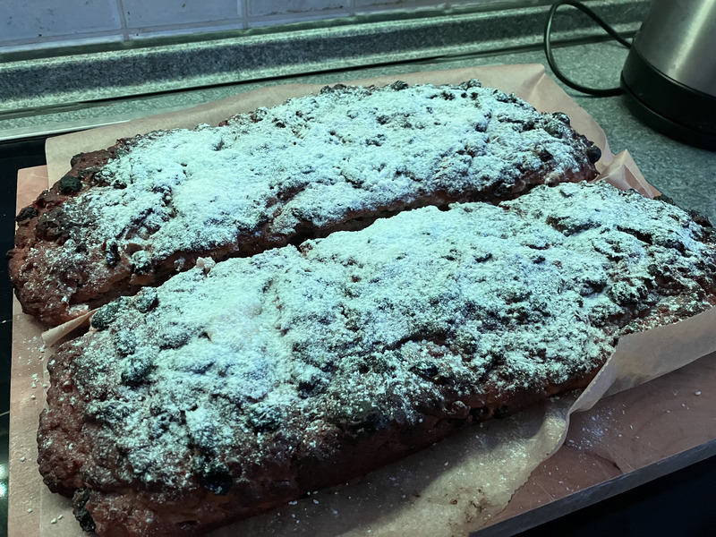
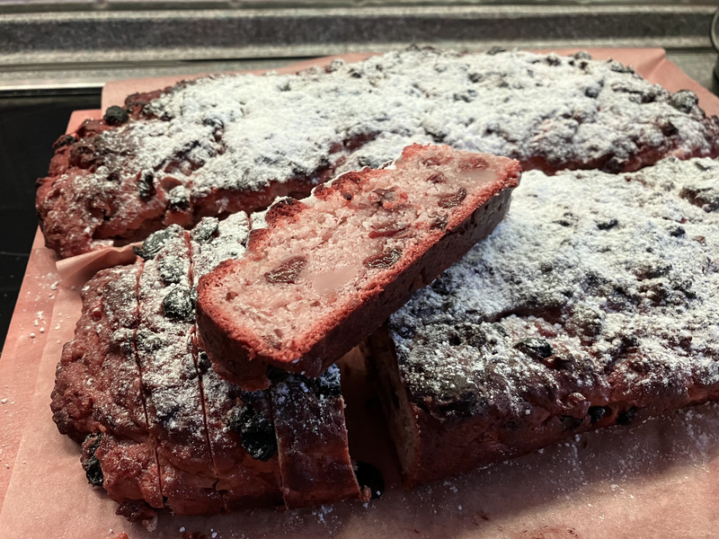

+++
author = "Johannes Ehm"
title = "Ho ho ho ein Christstollen ist da ..."
date = "2022-12-18"
description = "Ho ho ho ein Christstollen ist da ..."
tags = [
	"baking",
	"backend",
	"bread",
	"brot",
	"christstollen",
	"german"
]
draft = false
+++

Der Dezember hat bis jetzt viele erwartete und unerwartete Überraschungen gebracht. Mein Geburstag und die Vollendung eines Lebensjahrzehnts ist eine erwartete schöne Überraschung. Eine andere unerwartete Überraschung mag das nächste Lebensjahrzehnt prägen. Mein Christstollen dagegen, ist eine erwartet unerwartete Überraschung. Nach der Rückkehr aus Nepal habe ich mich gefreut einen Stollen zu backen. Ich finde jeden selbstgebackenen Stollen besser als einen gekauften Stollen. In einem selbstgebackenen Stollen steckt Arbeit und ein einzigartiges Überraschungsmoment, ob der Stollen nach all der Arbeit gelungen ist. Jeder Stollen hat seinen Charakter und jeder Charakter ist gut, da gerade die Vielfalt Stollen interessant macht. Wie immer habe ich mich an ein Rezept des [Plötzblogs](https://www.ploetzblog.de/stollen/) gewagt. Ich habe unterschiedliche Vorteige vorbereitet. Ich habe mit einer Gewürzmühle verschiedenste Gewürze verarbeitet und in den Teig eingearbeitet. Ich habe Früchte in Wein und Rum eingelegt. Und ich habe mich auf den Moment gefreut den eigenen Stollen zu probieren. Und ich war begeistert vom eigenen Stollen, gerade weil mein Stollen mit jedem Bissen einen anderen Charakter zeigt. Mal ist der Stollen süß, wenn man etwas vom Zucker erwischt, mal ist der Stollen fruchtig, wenn man etwas von den Früchten erwischt, mal ist der Stollen würzig, wenn man etwas mehr von mit Gewürzen versetzten Teig erwischt. Nicht oft gebe ich selbstgebackenes an Familie oder Freunde weiter, aber dieses Mal habe ich mich geradezu gefreut andere an meinen Stollen teilhaben zu lassen. Aber gerade, wenn man mit seiner eigenen Leistung glücklich ist, ist es eine unerwartete Überraschung, wenn das Ergebnis vermeintlich nicht wertgeschätzt wird, sondern als zu lange gebacken und zu wenig fluffig kritisiert wird. Ich komme ins Grübeln als die Frage gestellt wird, welches Mehl ich verwendet habe, da der Stollen nicht fluffig sei. Ich bin unsicher, ob ein Stollen fluffig sein muss - ich denke eher nicht. Ich denke, dass ich mit dem Öko-Weizenmehl Type 550 der [Hofbräuhaus-Kunstmühle München](https://www.hofbraeuhaus-kunstmuehle.de/) ein hervorragendes Mehl verwendet habe, dass ein Mehl aufgrund des vom Mehl abhängigen Klebergerüstes zwar für die Lockerheit eines Teiges mitverantwortlich ist, aber dass es die Gärgase der Hefebakterien sind, die das Klebergerüst des Teiges fordern, dass es die Hefebakterien aber schwer haben einen mit getränkten Früchten, gemahlenen und ungemahlenen Nüssen versetzten Teig locker zu machen. Vielleicht ist es eher die Vielfalt überfordert. Vielleicht ist es deswegen nicht verwunderlich, dass in den Kommentaren zum Rezept über das Rezept gestritten wird, anstatt wertschätzend und dankbar zu sein. Ich bin dankbar für alles was der Dezember gebracht hat. Ich bin mir sicher, dass das neue Jahr weitere schöne Überraschungen bringen wird. Ich freue mich jetzt schon auf die schönen und einzigartigen Überraschungen und ich bin mir sicher, dass es auch nächstes Jahr wieder einen schönen, einzigartigen und vielfältigen Christstollen geben wird.

