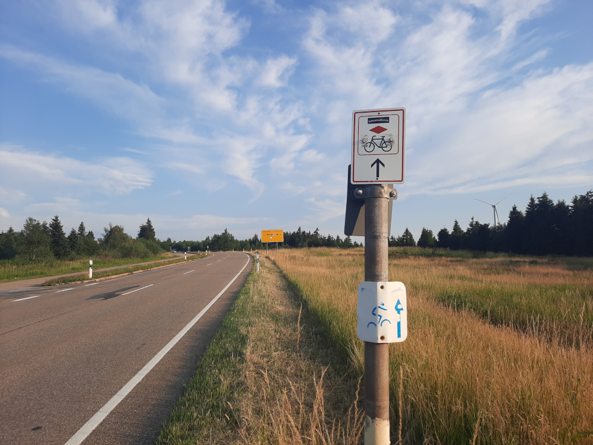

+++
author = "Johannes Ehm"
title = "100 km Westweg"
date = "2023-07-15"
description = "100 von 300 Kilometer Westweg - von Nord nach Süd durch den Schwarzwald"
tags = [
	"cycling",
	"Radfahren",
  "gravel",
	"english"
]
draft = false
+++

Am 9. Juli 2023 bin ich von München nach Pforzheim aufgebrochen, um auf dem Westweg mit dem Ziel Basel den Schwarzwald von Nord nach Süd zu durchqueren. Der [Westweg](https://www.schwarzwaldverein.de/schwarzwald/wanderwege/fernwanderwege/westweg) ist der älteste Höhenweg im Schwarzwald und führt auf dem Weg nach Basel über zahlreiche Berge direkt durch die Kernzone des Schwarzwaldes. Seit einigen Jahren gibt es neben dem Fernwanderweg auch einen [Westweg-Radweg](https://www.schwarzwaldverein.de/schwarzwald/wanderwege/schwarzwald-radweg) mit der Strecke von Karlsruhe nach Lörrach. Der originale Radweg hat eine Strecke von 375 Kilometer mit über 7000 Höhenmeter. Meine anvisierte [inoffizielle Variante](https://www.komoot.de/tour/8581268) sollte immer noch 295 Kilometer und über 6000 Höhenmeter haben. Auf mehreren Tagen verteilt über 6000 Höhenmeter zu fahren ist immer noch ein anspruchsvolles Unterfangen, zumal der überwiegende Teil der Strecke über Schotterwege führt und es an dem Tagen meiner Ausfahrt Temperaturen von über 30 Grad angekündigt waren. Aber was gibt es Schöneres sich einem anstrengenden Abenteuer zu stellen und sich mit einem Rad mit dem Schwarzwald zu messen, nachdem ich schon mehrmals die Alpen bezwungen habe. Es war die erste Bikepacking Tour mit einem Gravelrad. Früher war ich mit Stahlrahmen und Satteltaschen in den Alpen unterwegs. Jetzt bin ich mit Alurahmen und Bikepacking-Taschen unterwegs. Meine Erinnerungen an die Radltage mit heißen Temperaturen und meine Erinnerungen an die schwierigsten Radltage meiner Velokarriere im Schweizer Jura - auch nur ein Mittelgebirge - hätten eine Warnung sein können, mein Abenteuer nicht zu überambitioniert anzugehen. Ich sollte gleich am Ende des ersten Tages meinen Plan über den Haufen werfen und die folgenden zwei Tagen auf [den einfacheren Schwarzwald Panoramaweg](https://www.komoot.de/tour/33711153) verbringen.

Der erste Abschnitt am ersten Tag führt von Pforzheim in das schon sehr hoch gelegene Doben mit schönen Ausblicken in die weite Ebene des Rheingrabens. Es ist Sonntag und es sind viele Rennradfahrer und Mountainbiker  in der Gegend unterwegs. Teerstraßen, Teerwege und Schotterwege schlängeln sich in die Höhe und bieten ein angenehmes Terrain einzurollen, Höhenmeter zu gewinnen und den ersten Gipfel der Tour zu erreichen - der 989 Hohe Hohloh. Auf einem Wohnmobilstellplatz in Doben kann ich noch einmal einige Liter Wasser tanken, bevor ich viele Kilometer durch den Schwarzwald bis zur nächsten Stadt Forbach fahre. Im Schatten ist es angenehm. In der Sonne schon heiß und in Forbach nach einer langen Abfahrt sehr heiß. Die Abfahrt ins 500 Meter tiefer gelegene Forbach ist ein echter Hitzeschock. Der anschließende Anstieg zur Schwarzen-Talsperre bei über 30 Grad und 13 Prozent Steigung bringen mich nach einigen Kilometer an meine Grenzen. Normalerweise ist kein Anstieg zu lang, aber durch den nach wenigen Kilometer Anstieg einsetzenden Wasserfall aus Schweiß muss ich kapitulieren und ungefähr einen Kilometer schieben, um weiter Höhe zu gewinnen und um den Körper zu beruhigen. So schwierig und so langwierig hatte ich zu diesem Zeitpunkt mir die Tour nicht vorgestellt. Ich wollte zu diesem Zeitpunkt doch schon einige Kilometer weiter sein und musste dennoch erkennen, dass gegen Hitze nicht viel auszurichten ist, außer die Weiterfahrt zu verschieben und an der Talsperre eine Pause von zwei Stunden einzulegen. Nach der Talsperre geht es aber gleich wieder mit bis zu 11 Prozent Steigung nach oben. Die aufziehenden Wolken und die gewonnene Höhe machen aber die Weiterfahrt erträglich. Die Fahrt durch die Kernzonen des Schwarzwaldes sind ein echtes Highlight. Es ist schön auf dem Fahrrad in einer guten Geschwindigkeit durch Lebens- und Naturräume zu fahren und zu sehen wie sich Menschen und Landschaften verändern. In der Kernzone des Schwarzen Waldes ist mir die Geschwindigkeit des Fahrrades zu schnell. Ich wäre gerne geblieben, um den Wald zu erkunden. Die viele urige Unterkünfte wären eine gute Gelgenheit gewesen schön in schöner Umgebung zu übernachten. Ich habe mich dagegen entschieden um an meinen Plan festzuhalten. Nach der Kernzone geht es lange über die Hochschwarzwaldstraße angenehm schnell in den Süden. Mit der Abenddämmerung entscheide ich mich aber nach Freudenstadt abzufahren und den Westweg zu verlassen um eine Chance zu haben etwas Essen zu bekommen und eine gute Unterkunft oder ein gutes Nachtlager zu finden. In Freudenstadt finde ich ein Restaurant aber keine Unterkunft. Ich finde kein Trinkwasser, aber eine Sitzbank neben etwas fließenden Wasser neben dem Rathaus in Loßburg. Die Sitzbank ist etwas versteckt. Es ist inzwischen Nachts. Es sind noch einige Jugendliche unterwegs die auf dem Platz vor dem Rathaus kommen. Eine Gruppe entdeckt mich und fragt mich später, was ich mache und woher ich komme. Es ist unangenehm entdeckt zu werden. Noch etwas unangenehmer ist es, wenn Frühs um halb 5 die Mülltüten der Müllkörbe ausgetauscht werden und ich wieder entdeckt werde. Die Gespräche sind aber neugierig und freundlich. Es wird von Söhnen erzählt, die in Afrika leben und auf unverschlossene Tiefgaragen hingewiesen, die sich auch als Übernachtungsplatz angeboten hätten. Mit einem Regenradar, das Blitz und Donner in der Ferne zeigt, beginnt noch vor der Dämmerung der neue Tag.

Der zweite Tag ist etwas weniger spektakulär als der erste Tag. Erste Tage sind oftmals auf Radtouren sehr schwer. Am zweiten Tag rollt es sich gut und man ist auf der Tour angekommen. Das erste Ziel ist ein erstes Frühstück in einer hervorragenden Tankstelle in der Nähe von Betzenweiler. Es geht mit dem Blick auf Regenradar und Wolken weiter bis nach Sulgen. Bei einem zweiten Frühstück wird ein Gewitterschauer überbrückt. Die Verkäuferinnen sind interessiert und freundlich. Ich erzähle, wie sehr ich die Gegend schätze und ich es schön finde den Schwarzwald zu erkunden. Als ich in Villingen erwacht die Stadt. Ich bin dagegen schon einige Stunden unterwegs. Es geht weiter nach Titisee und wieder richtig in den Schwarzwald. Ich bin glücklich trotz den Schwierigkeiten am ersten Tag noch im Schwarzwald unterwegs zu sein. Es tut gut wieder richtig in den Schwarzwald hineinzufahren und ein richtiges Tagesziel zu haben. Im Action Foresthotel habe ich ein Einzelzimmer reserviert um mittags noch einmal auszuschlafen und um nachmittags in die Therme zu gehen. Die Sauna der Therme ist an diesem Montagabend leer. Es ist erholsam die müden Muskeln bei heißen Aufgüssen und im kalten Wasser zu entspannen.

Mit Schlaf, Erholung und einem Ziel fährt es sich am dritten Tag noch besser. Es ist der letzte Tag. Ich muss am Abend zurück nach München. Eigentlich müsste jetzt aber die Tour richtig beginnen. Es geht von Titisee nach Waldshut und es wird genau wie am ersten Tag wieder sehr heiß. Gegen Mittag wird das Wasser knapp und das Smartphone spielt aufgrund der Hitze verrückt. Zur Abkühlung und um meinen Erfolg in der Niederlage zu feiern, springe ich in den kühlen Rhein. Ich bin stolz etwas gewagt zu haben und trotz den Schwierigkeiten aufgrund der Hitze noch etwas erreicht zu haben, obwohl ich Basel auf dem Westweg nicht erreicht habe. Ich werde zurück kommen, um auch die anderen Abschnitte des Westwegs im Schwarzwald zu fahren.


<iframe src="https://www.komoot.de/tour/1207535480/embed?profile=1" width="100%" height="700" frameborder="0" scrolling="no"></iframe>

