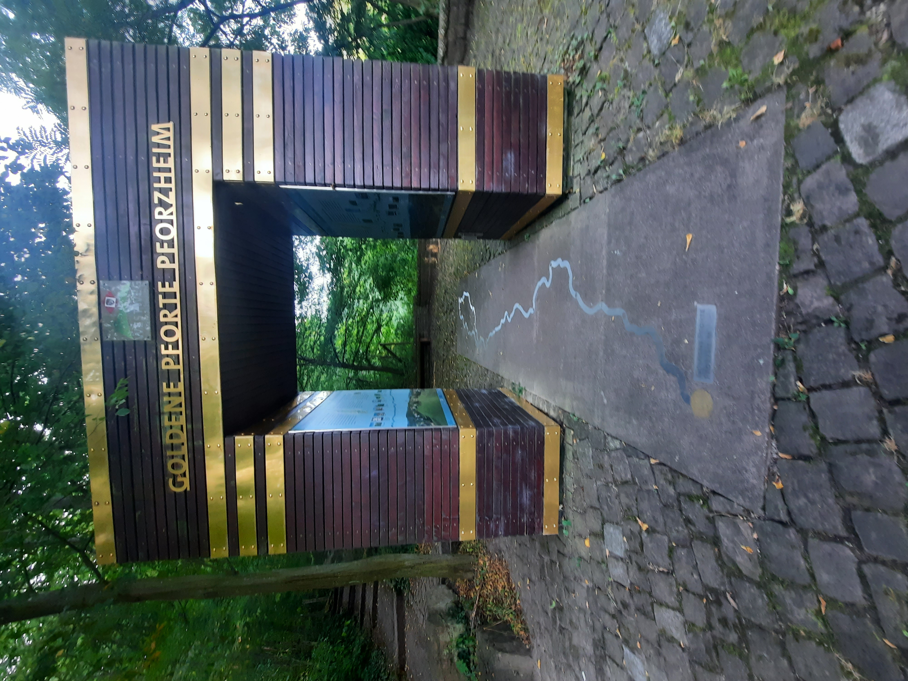
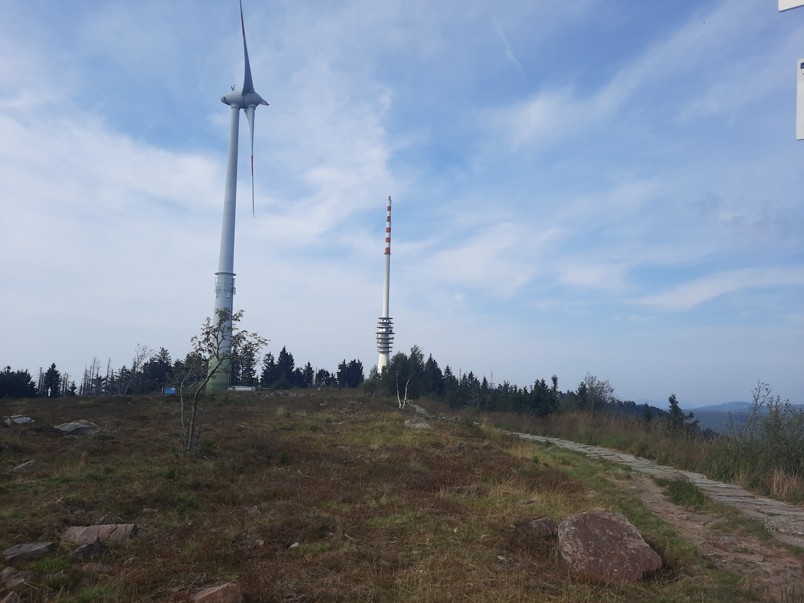
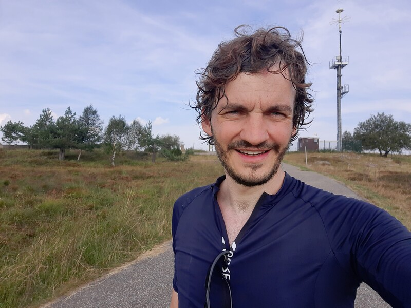
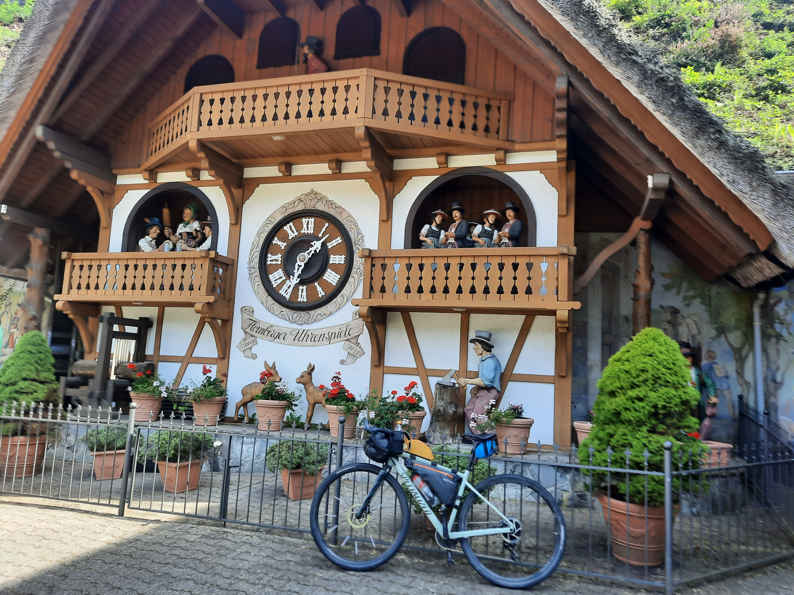
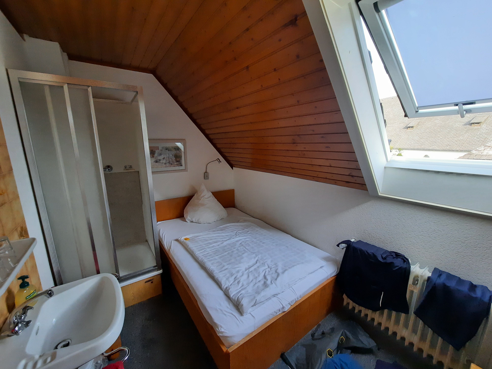
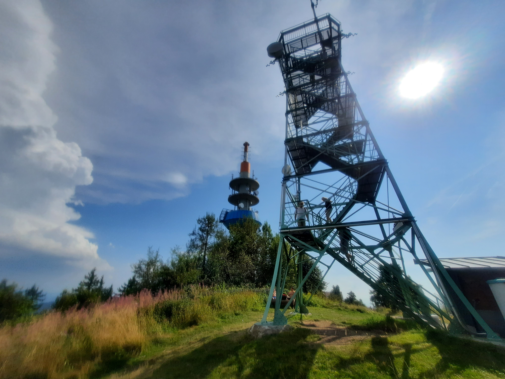
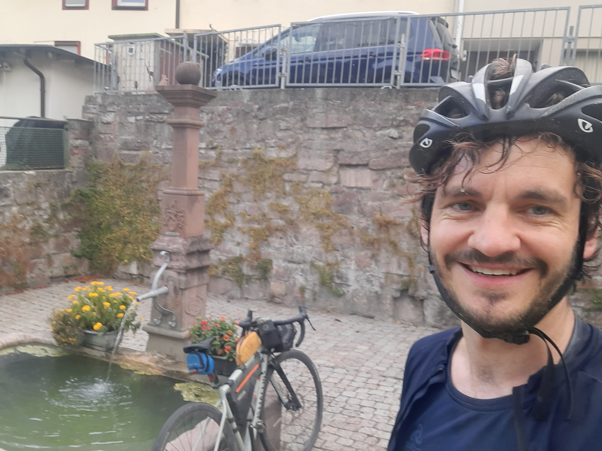
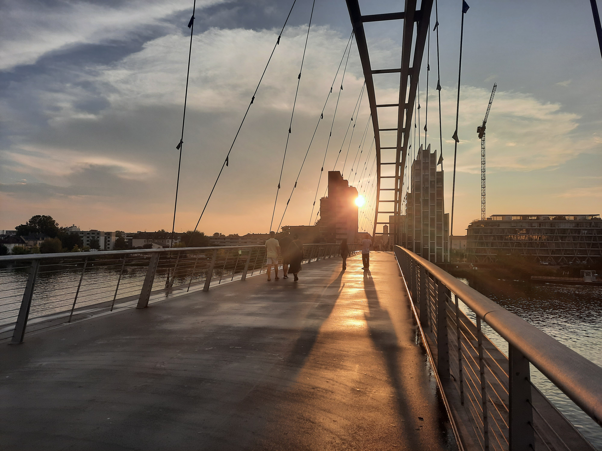

+++
author = "Johannes Ehm"
title = "341 km Westweg - Pforzheim nach Lörrach"
date = "2024-08-30"
description = "341 Kilometer Westweg in drei Tagen - von Pforzheim nach Lörrach durch den Schwarzwald"
tags = [
	"cycling",
	"Radfahren",
  "gravel",
	"english"
]
draft = false
+++

Der Himmel im Landschaftspark vor Basel hatte inzwischen ein bedrohliches Schwarzblau angenommen. Die Regentropfen prasselten auf meinen Helm. Mein Atem ging schneller mit dem Ziel im Hinterkopf und der Aussicht auf den sicheren Schutz der Stadt. Plötzlich ein weißes Licht von links und dann, kein Donnern, sondern ein Bersten, als würde es alle Bäume um mich herum zerreißen. Ein Schlag durchzog meinen ganzen Körper von oben nach unten. Zwischen mir und dem einschlagenden Blitz müssen es nur Meter gewesen sein. Ich konnte nicht glauben, dass meine 3 Tage auf dem Westweg so enden sollten, nachdem ich es nun geschafft hatte. Es war der dramatische Schlusspunkt einer abenteuerlichen Tour in der ich endlich den Westweg bezwungen hatte. Am 30. August 2024 war ich angetreten den Westweg im zweiten Anlauf endlich zu bezwingen - nachdem ich ein Jahr zuvor kläglich gescheitert war.

Es ist nun schon etwas her, dass ich diesen zweiten Versuch unternommen habe, da ich den Bericht dazu am 9. Mai 2026 schreibe. Es hat mich gewurmt, wie unvorbereitet ich beim ersten Versuch den Westweg angegangen bin. Voll im Gravel-Bike-Packing-Ultra-Fieber durch Podcasts und Videos stand ich am ersten Tag im Schwarzwald Nationalpark etwas ermüdet, ohne Verpflegung, ohne Plan wo ich übernachten könnte und ohne Mut die Route in der Nacht weiter zu fahren. Beim zweiten Versuch habe ich mich darauf besinnt, dass ich den Westweg nicht als Rennen, sondern als gut geplantes Abenteuer angehe, mit einem Übernachtungsplan für die erste Nacht, mit einer besseren Verpflegung alleine dadurch, dass ich in einem Hotel essen kann und mit dem Plan den Westweg bei Tag zu fahren. Wie ich bei Beginn des zweiten Versuchs am zweiten Tag gemerkt habe, war das eine gute Entscheidung, weil ich gesehen habe, dass mich ansonsten in der Nacht ein wirklich schwieriger Abschnitt mit Schiebe und Tragepassagen auf mich gewartet hätte. Bei sowas muss man schon wissen, was man tut und das wusste ich beim ersten Versuch nicht.

Also ging es am 30. August 2024 wieder nach Pforzheim, um den Westweg ein zweites Mal zu starten. Es warteten heiße Temperaturen und als Ziel auf der ersten Etappe mit dem [Zuflucht Natur- und Sporthotel](https://www.hotel-zuflucht.de/) mitten im Nationalpark ein schönes Hotel. Auf der zweiten Etappe sollte es nach Titisee in die etwas spartanische Pension [Wald und See](https://www.waldundsee.de/) gehen. Auf der dritten Etappe war es mein Ziel den Westweg endlich fertig zu radeln, in Basel anzukommen und in Weil am Rhein im [BnB Hotel](https://www.hotel-bb.com/de/hotel/weil-am-rhein) zu übernachten.

## Tag 1: Pforzheim nach Zuflucht (Nationalpark Schwarzwald) (111 km)

Auf bereits bekannten Wegen ging es also von Pforzheim in den Nationalpark Schwarzwald ins Hotel Zuflucht. Ich war mir nicht sicher, wie ich es finden würde auf einer bereits gefahrenen Strecke nochmal unterwegs zu sein. Es war tatsächlich eine schöne Erfahrung und nicht so, dass ich alles schon gesehen hatte.  Ich konnte mir nochmal die Strecke und die verschiedenen Orte genau anschauen. Und so habe ich habe mir vorgenommen, dass jetzt, wo ich den Westweg wirklich fahre, auch die Westweg-Tore zu fotografieren, die ich bei meinem ersten Versuch nicht beachtet habe.

Ich wusste noch vom letzten Mal, dass es im ersten Stück bis Forbach schön angenehm in den Höhen des Schwarzwaldes geht und dass die Schwierigkeiten an diesem Tag mit insgesamt 2600 Höhenmeter erst ab Forbach kommen. In meinem letzten Versuch war ich mit meiner Abfahrt nach Forbach unzufrieden, weil meine Strecke einen Trailabschnitt enthielt, der mit meinem Gravel-Bike nicht wirklich gut zu fahren war. Dieses Mal habe ich mir eine andere Abfahrt nach Forbach ausgesucht, die dazu geführt hat, dass ich mich gleich mal so richtig verfahren habe. Auch schön, mal einfach irgendwo im Schwarzwald unterwegs zu sein und ohne guten Track und gute Karte zu versuchen zu navigieren. Letztendlich habe ich mich entschieden, einfach zurückzufahren und meinem Weg zu folgen, auch wenn ich dadurch ein paar Kilometer mehr im Schwarzwald gesammelt habe. In Forbach fand ich beim letzten Mal den Anstieg in die Nähe der Schwarzenbachtalsperre unheimlich schwierig weil die Strecke steil bei extrem hohen Temperaturen war. Ich hatte dieses mal hier auch einen anderen Weg herausgesucht, was sich aber nach ein paar Metern als unfahrbar erwiesen hat. Also musste ich doch den eigentlichen Anstieg fahren, welcher aber im Gegensatz zum letzten Versuch fahrbarer war. Die Temperaturen waren ebenso heiß, ich habe ähnlich viel geflucht. Mein erster Gang ging nicht, da ich vor meiner Abfahrt nach Pforzheim auch nicht wirklich Zeit hatte das Fahrrad noch einmal richtig zu prüfen, aber letztendlich habe ich es geschafft. Ganz oben im Nationalpark ging es dann sehr flüssig, wobei ich wie letztes Jahr nur teilweise die Schotterstraßen an der Schwarzwaldhochstraße gefahren bin und auch einfach über die Teerstraße auf die Hornisgrinde gefahren bin. Es ist ein gutes Gefühl gewesen endlich mal auf der Hornisgrinde zu sein. Einfach schön da oben, etwas müde, aber mit gutem Gefühl, weil nach 15 weiteren Kilometern das Hotel mit einer Dusche und einem Bett auf mich wartete.


<iframe src="https://www.komoot.com/de-de/tour/1827866418/embed?share_token=aAC1DmG7PM226LYMeXrekA4Vyd6ejKuQTNBoPhcUH13MaPR2vs&amp;layout=classic&amp;profile=1" width="100%" height="700" frameborder="0" scrolling="no"></iframe>


## Tag 2: Zuflucht nach Titisee (113 km)

Am zweiten Tag erwartete mich ein extrem heißer Tag mit Temperaturen nahezu an die 40 Grad. Umso tragischer war es langsam die Höhen und damit auch die Frische des Nationalparks zu verlassen und in Hausbach in das Tal Richtung Triberg und Schonach zu fahren. Unmittelbar davor ging es auf schwer befahrbaren Schotterstraßen und Wanderwege mit Schiebe- und Tragepassagen hin zu einer Teerstraße mit der Abfahrt Richtung Hausbach. Die Straße zwischen Bad Peterstal und Wildschapbach war eine wunderbare Abfahrt im richtigen Tempo, mit der richtigen Anzahl an Kurven und einem angenehmen Verkehr. Es ist einfach schmerzhaft mit dem Fahrrad unterwegs zu sein und überall Orte zu sehen, die man sich gerne länger und genauer anschauen möchte, aber die Strecke ist einfach zu wichtig, um anzuhalten und Tage an einem Ort zu verweilen. Fahrrad fahren ist das richtige Tempo, um sich fortzubewegen und die Landschaften und die Übergänge zwischen den Orten zu erleben, aber dann doch zu schnell die Orte kennenzulernen, wenn sie verlockend erscheinen.

Nach Hausach ging es durch ein heißes Tal direkt in das touristische Herz des Schwarzwalds, mit Triberg und Schonach. Meine Route sollte kurz vor Triberg abzweigen, um über einen weiteren steilen Anstieg nach Schonach zu führen. Es war erleichternd wieder in den Höhen des Schwarzwalds und damit in der Kühle zu sein, aber der Anstieg war wieder richtig steil und richtig hart. Es ging nach Schonach über eine wunderschöne Hochebene an einem See, einer Biathlonanlage, hin zu einem Schild mit einem Verweis auf die Donauquelle und damit den Ursprung der Donau. Wie lockend war es dem Schild zu folgen und die Donauquelle zu besuchen, aber die Strecke, der Westweg und das rechtzeitige Ankommen in Titisee waren zu wichtig. Nach Titisee sollte es noch eine ganz schöne lange Strecke geben. Ich wusste ja noch nicht, dass vor dem Hexenloch ein langer und steiler Wanderweg auf mich wartete und ich das Rad über eine lange Strecke tragen musste. Die eigentliche Schmach war aber, dass der Wanderweg an einem Rastplatz endete, wo es gerade eine Party gab. Was für eine Schmach, mit dem Fahrrad auf der Schulter rutschend, schwitzend und einen Gesichtsausdruck der Erlösung aus dem Gebüsch zu kommen, um sich dann anhören zu müssen, dass das wohl nicht das richtige Fahrrad für den Wanderweg war. Mit einem Schmunzeln im Gesicht ging es schnell zum Hexenloch, um sich über eine atemberaubend schöne kleine Straße wieder in die Höhen des Schwarzwalds zu schrauben. Der Schwarzwald überzeugt einfach durch die Vielfalt der kleinen Straßen, die in keiner Art und Weise sich vor den mit Verkehr überladenen Alpenstraßen verstecken müssen. Ich muss fast sagen, dass der Schwarzwald in weiten Teilen das schönere Gelände, die schönere Vielfalt und ähnliche Herausforderungen als die Alpen bietet. Es zog sich dann noch nach Titisee, aber dank einer rasanten Abfahrt ging es dann doch schneller als erwartet in die Pension Wald und See mit einem kleinen Zimmer im obersten Stockwert.

Mit nur knapp 2000 Höhenmeter und ein paar steilen Rampen war der zweite Tag trotzdem einfacher als der erste, auch weil der erste Tag immer der schwierigste ist, aber die Hitze im Tal herausfordernd war.


<iframe src="https://www.komoot.com/de-de/tour/1830627107/embed?layout=classic&amp;profile=1" width="100%" height="700" frameborder="0" scrolling="no"></iframe>


## Tag 3: Titisee nach Lörrach und weiter nach Basel und Weil am Rhein (117 km)

Mit zwei Tagen auf dem Westweg konnte am dritten Tag eigentlich nichts mehr schief gehen. Die Knie taten weh, aber mit einer etwas höheren Sattelposition war das Problem gelöst. Die Wolken türmten sich am Himmel, aber ich meinte ausschließen zu können, dass mich ein Gewitter erwischen würde. Bis zum schauerlichen Ende der Tour war ohnehin noch eine Etappe mit drei Bergen zu bezwingen. Der erste Berg war kein anderer als der Feldberg kurz hinter Titisee. Ok, es ging zwar nicht ganz bis nach oben, aber es ging doch ordentlich und vor allem steil nach oben. Am dritten Tag war ich aber schon so im Flow, dass ich den Anstieg richtig genießen konnte. Mit entsprechenden Verpflegungsstellen und Brunnen mit Frischwasser ist es auch kein Problem viel zu schwitzen und trotzdem ausreichend Flüssigkeit zu sich zu nehmen. Wie schön wäre es doch solche Verpflegungsmöglichkeiten südlich von München in meinem Heimatrevier zu haben.

Es war eine herrliche Gegend mit dem Gravel-Rad unterwegs zu sein. Es ging hoch. Es ging runter. Immer über 1000 Meter Höhenunterschied. Wie gerne wäre ich hier mal im Winter mit den Skiern unterwegs. Perfekte Schotterstraßen und endlich ein anderer Radler. Bis dahin war ich als Bike-Packer alleine unterwegs. Natürlich gab es hin und wieder Rennradfahrer, aber niemand mit Gepäck und schon gar niemand mit einem Gravel-Bike. Der zweite Berg war der Belchen. Auf dem Belchen war es vorbei mit der Ruhe. Zwar war ich auch der einzige Bike-Packer, aber dafür gab es Rennradler vorne und hinten. Der Belchen scheint ein tolles und beliebtes Ziel für Rennradler zu sein. Es geht auch richtig schön auf einer Teerstraße nach oben, frei von Verkehr. Meine Abfahrt war dagegen für Radler gesperrt. Was mache ich jetzt? Fahren, schieben oder tragen? Natürlich tragen, um die Natur zu schonen. So ging es runter bis nach Neuenweg zur steilsten Rampe der ganzen Tour zu führen. Meine Daten sagen 14%, aber niemals? Das muss doch locker 20% gewesen sein. War aber auch schnell wieder vorbei, um in einer langen Fahrt zum dritten und letzten Berg den Blauen zu führen. Sehr schön, aber mit den vielen Quell- und Gewitterwolken schon richtig bedrohlich. Wo ich herkam hat es gefühlt schon gewittert und wo ich hinwollte sah es auch nicht gut aus.

Auf dem Weg nach Basel hat mich das Gewitter dann eingeholt. Ich finde es immer erstaunlich, wie entspannt die Menschen um einen herum wirken, wenn die Blitze einschlagen und das Wetterchaos ausbricht. Im Landschaftspark kurz vor Basel geschah es dann: Das weiße Licht von links und das überall das Bersten, von dem ich eingangs erzählte. Nur wenige Meter passierte ich eine Gruppe von vier Menschen die fast heulend auf dem Boden knieten. Zuerst verstand ich nicht was los war. Ist hier der Blitz eingeschlagen? Ist jemand verletzt? Ich sah einen Hund, der vor Panik völler außer sich war - und seine Menschen mit ihm. In diesem Moment wird einem wieder klar wie schmal der Grat zwischen Abenteuer und Gefahr ist. Ich suchte mir einen Unterschlupf und wartete bis ich entspannt meine Radfahrt forsetzen konnte. Naß und mit guten Gefühl habe ich den Westweg im Dreiländereck erfolgreich beendet.


<iframe src="https://www.komoot.com/de-de/tour/1833735638/embed?layout=classic&amp;profile=1" width="100%" height="700" frameborder="0" scrolling="no"></iframe>
