+++
author = "Johannes Ehm"
title = "0 Passes in Nepal"
date = "2022-11-26"
description = ""
tags = [
	"trekking",
	"wandern",
	"deutsch"
]
draft = false
+++

Erschöpft vom langen Flug und von den ersten Eindrücken in Kathmandu fallen wir ins Bett. Nach 3 Jahren Covid-Pandemie habe ich ganz vergessen wir verrückt und anstrengend das interkontinentale Reisen mit dem Flugzeug ist, ganz zu schweigen von den Treibhausgasemissionen die die eigene jährliche Klimabilanz zerstören. Innerhalb von Stunden verlassen wir Europa und Reisen nach Nepal in Asien. Jetlag, Taxipreise und das Herantasten an das Land, die Leute und die Uhrzeit prägen die ersten Stunden. Nach fünf Jahren bin ich wieder in Nepal. Ich habe es nicht vermisst mit Taxifahrern um Taxipreise zu ringen. Ich bin überrascht, dass die ersten Taxifahrer am Flughafen gigantisch hohe Summen verlangen und nicht auf meine Versuche den Preis zu verhandeln eingehen. Mit Taxifahrern in Nepal um den Preis zu feilschen ist immer ein hin und her aus Schuldgefühlen als reicher Westler und dem Anliegen einen fairen Preis zu bezahlen. Überhaupt merken wir schon in den ersten Stunden, dass wir als Westler wirklich reich sind und in ein sehr armes Land reisen. Ich werde später merken, dass sich in den letzten fünf Jahren etwas an der Infrastruktur getan hat, aber Nepal war arm, ist arm und bleibt arm. Die Taxifahrer erzählen, dass der Sprit doch so teuer sei und außerdem gerade Feiertag sei. In der Tat kommen wir genau in der Mitte des Diwali-Festes in Nepal an. Diwali ist ein bedeutendes hinduistisches Fest. Es ist das Lichterfest der Hinduisten - wobei ich gleich ob den Erzählungen des Taxifahrers an welchem Diwali-Feiertag was genau gefeiert wird unsicher bin ob ich die Bedeutung des Festes richtig verstanden habe. Wir verstehen, dass nicht nur der Feiertag von Bruder und Schwester, der Feiertag der Kuh, der Feiertag des Hundes gefeiert wird, sondern auch das neue Jahr. Ich vermute aber, dass es in den letzten Jahren auch in Nepal gesellschaftlichen Fortschritt gab als ich dem Taxifahrer zuhöre: vor fünf Jahren gab es nur den Feiertag des Bruders - fünf Jahre später gibt es den Feiertag von Bruder und Schwester. Sogleich versuche ich aber die Anmerkung des Taxifahrers zu überhören, dass am Feiertag von Bruder und Schwester die Schwestern dem Bruder etwas schenkt und nicht umgekehrt und freue mich, dass wir an einem solch hohen Feiertag in Nepal angekommen sind. Es ist Diwali - in Kathmandu feiern die Menschen das neue Jahr, sie feiern Brüder und Schwester, sie feiern ausgelassen, tanzend mit lauter Musik auf den durch die Stadt fahrenden Jeeps. Es ist beglückend zuzusehen.



Inzwischen haben wir verstanden, warum wir so hart mit den Taxifahrern handeln müssen. Wir wohnen außerhalb von Thamel, dem touristischen Zentrums Kathmandus. In unseren Komplex liegt das teuerste Hotel Kathmandus. Wir wohnen in einer Pension mit drei Zimmern innerhalb des Komplexes. Es gibt hier teure Restaurants. Uns ist während den Feiertagen nicht aufgefallen wo wir wohnen, da während den Diwali-Feiertagen alles geschlossen war. Klar, dass die Taxifahrer denken, dass es sich hier um zwei reiche Zeitgenossen handelt, dabei haben wir nur nach einer ruhigen und schönen Unterkunft gesucht. Mit den öffnenden Läden nach dem Ende der Feiertage wird das Leben innerhalb des historischen Komplexes sehr angenehm und schön. Leider müssen wir aber in der folgenden Nacht um 1 Uhr aufbrechen um den Bus nach Remchap zu nehmen und mit dem Flugzeug von Tara Air nach Lukla zu fliegen. Das Trekking soll beginnen.

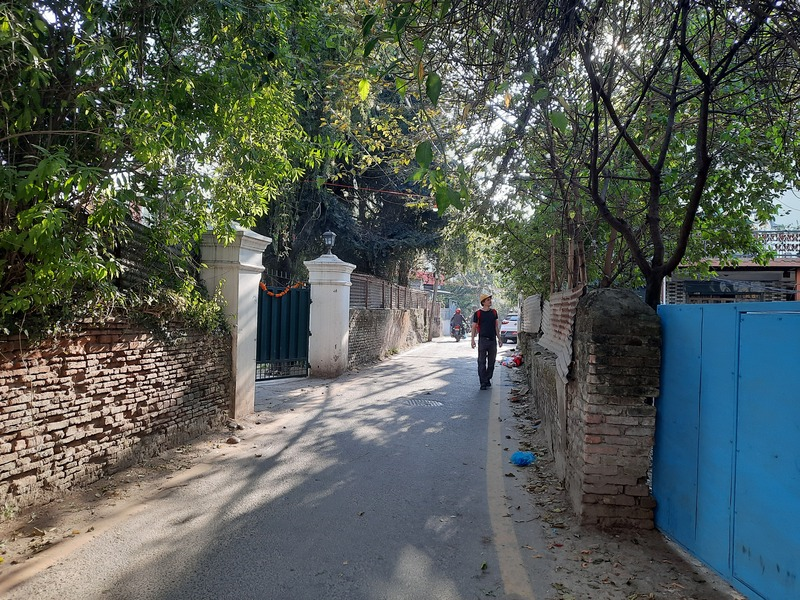

Die Tage vor dem Trekking waren sehr von den Vorbereitungen für unsere Tour geprägt. Wir haben uns dafür entschieden den 3-Passes-Trail im Sagarmatha-Nationalpark zu laufen. Wir haben uns entschieden wie viele andere Touristen mit dem Flugzeug nach Lukla zu fliegen. Wir haben uns damit gleichzeitig dagegen entschieden mit dem Jeep nach Salleria zu fahren und in wenigen Tagen von Salleri nach Lukla zu laufen. Es wäre sinnvoll die zusätzlichen Tage in Kauf zu nehmen. Es ist aber auch zu verlockend mit dem Flugzeug auf einem berühmten Flughafen zu landen und direkt ins Geschehen katapultiert zu werden. Wir müssen also Flugtickets, Bustickets und Permits organisieren. Wir werden später herausfinden, dass wir die Permits auch einfach vor Ort hätten kaufen können und dass einer der Permit nicht notwendig gewesen wäre. Wir müssen die benötigte Menge Bargeld berechnen. Wir werden später herausfinden, dass es sowohl in Lukla als auch in Namche Geldautomaten und Wechselstuben gibt. Wir müssen überlegen ob wir alles haben was wir brauchen werden. Das Gepäck ist knapp bemessen - jedes T-Shirts und jede Unterhose zählt und ist wichtig. Wir ziehen alleine los ohne von einem Guide oder Träger unterstützt zu werden. Wir haben auf andere Touren schon Rucksäcke mit bis zu 20 kg getragen. Dieses Mal versuchen wir alles, um den 10 kg so nah wie möglich zu kommen, immerhin sind wir von Anfang an mindestens auf der Höhe der Zugspitze unterwegs. Durch die notwendige Vorbereitung fühlt es sich wenig nach Urlaub, sondern viel nach Arbeit an. Wir müssen immer wieder von unser außerhalb gelegener Unterkunft nach Thamel laufen oder fahren. Wir sind immer unterwegs. Die Momente an den wir die Stadt, die Stupas und die Freundlichkeit der Menschen genießen können sind rar. Ein Ausflug zum Affenfelsen ist schön. Es ist schön Essen zu gehen und die nepalesischen und indischen Gerichte zu entdecken. Es ist schön in Thamel einen Kaffee zu trinken, da Thamel über eine erstaunliche Dichte an italienischen Espressomaschinen verfügt. An den Tagen nach Diwali wacht die Stadt auf. Wir wollen nun aber aufbrechen und fragen uns ob wir nicht sogar früher hätten aufbrechen sollen. Vermutlich wäre es nicht gegangen und vermutlich hätten wir dann nicht David getroffen der uns allerletzte Ratschläge für unsere Tour mit auf den Weg geben wird. 



David ist ein 74-jähriger Brite, verheiratet mit Beni der Gründerin einer nepalesischen Hilfsorganisation. Am zweiten Abend hat David in einem Restaurant Flyer ausgeteilt in dem wir zu Abend essen. Die Flyer machen auf einen kleinen Laden in der Nähe des Restaurants aufmerksam. Im Laden werden viele kleine Gegenstände wie Taschen aus recycelten Materialien verkauft. Außerdem wird eine Kampagne präsentiert. Über die Kampagne wollen wir mehr wissen: Die Kampagne unterstütz heranwachsende Mädchen in abgelegen Bergdörfern mit einem Beutel mit Periodenartikel (Freedom Kit Bag) wie Einlagen aus Stoff und wasserundurchlässigen Materialien. David erzählt uns, dass Mädchen in Nepal oftmals unter schwierigen hygienischen Bedingungen aufwachsen müssen. Während der Periode, so schreibt es der Flyer und so erzählt es uns David, werden die Mädchen als unrein angesehen und werden des Hauses verwiesen. Ich verstehe die Initiative und glaube, dass es sich um ein sehr unterstützenwertes Projekt handelt. Im Gespräch will David wissen wir planen und was wir vorhaben: 21 Tage 3 Passes zu zweit, ohne Gruppe - ein respektvolles Unterfangen, das David in seiner britischen mit scharfer Ironie gespickten Art gefällt aber auch herausfordert um gleich im Gegenzug uns herauszufordern. Wir sollen die Tour aufschreiben und am nächsten Tag wieder kommen. Er sagt, dass er mindestens drei Fehler finden wird. Diese Herausforderung nehmen wir an, wobei der Plan ohnehin schon geschrieben ist. 

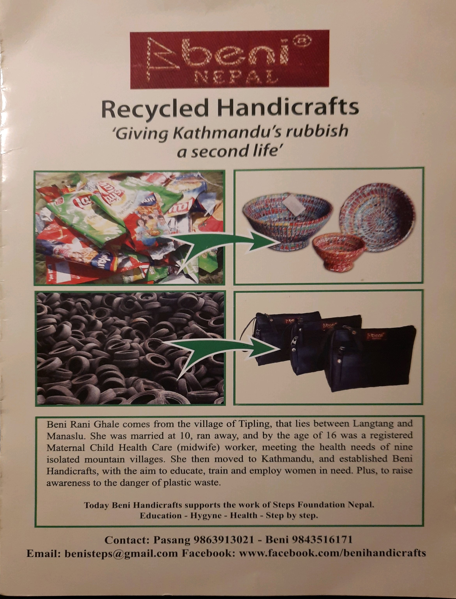

Einen Tag später sind wir zurück im Laden der Kampagne. David ist da und nimmt sich mit uns den Plan vor und wirft gleich ein: "your body is in shock when you arrive with the airplane in lukla". Er empfiehlt immer auf die Körperkerntemperatur zu achten und das schon bei der Ankunft in Lukla. Nicht die Flugzeuge anschauen, sondern die Jacke anziehen und die nächste gute Tee Bar aufsuchen und sich erholen. Eine Wanderung am Restday in Namche wird gestrichen. Erholung wird angeordnet. Eine Wanderung zum Akklimatisieren am Restday ist Unfug und "hike high sleep low" zu machen ist ohnehin absoluter Unfug. Eine ausreichende Hydrierung mit Tee, Suppe und Wasser ist der Schlüssel. Wichtig ist es immer warm zu bleiben und wenn es kalt wird dann einfach eine Wasserflasche mit heißem Wasser in den Schlafsack legen. David meint der Plan sei anspruchsvoll. Wir sollen es langsam angehen lassen und uns nicht zu viel vornehmen. Es ist keine Niederlage, wenn wir etwas nicht schaffen. Wir ahnen zu diesem Zeitpunkt noch nicht, dass wir nichts schaffen werden und es anstatt einem 3-Passes-Trek ein 0-Passes-Trek werden wird. Wir werden merken, dass die Regel die uns David am Ende mit auf den Weg geben wird die wichtigste Regel unseres Trek werden wird: seid nett zueinander. Die Höhe, die Kälte und meine Erkrankung wird die Regel auf die Probe stellen. 

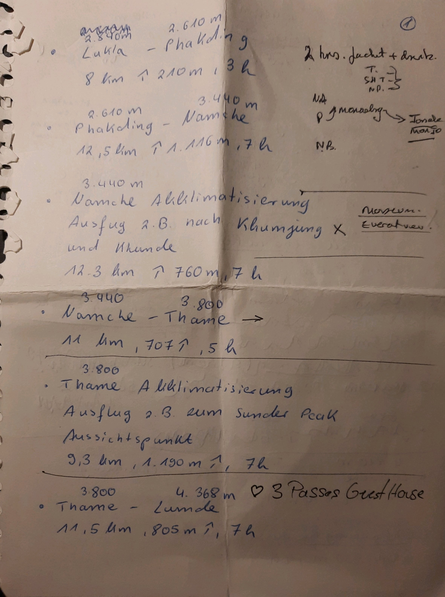

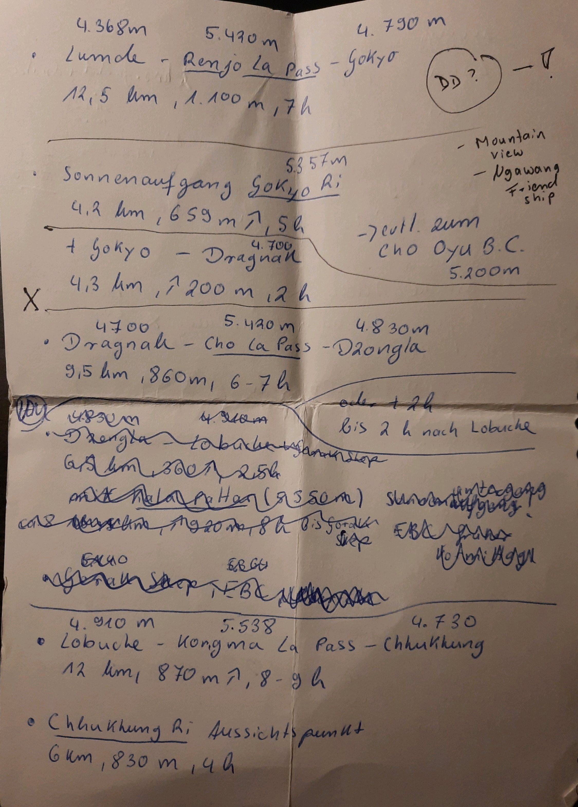

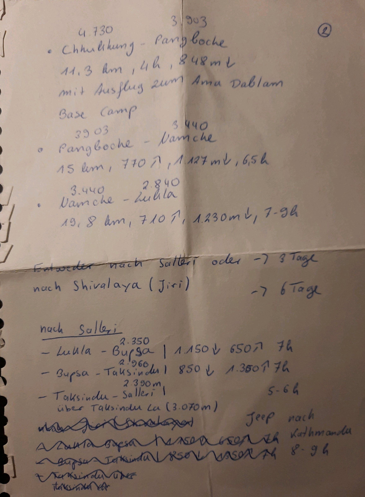

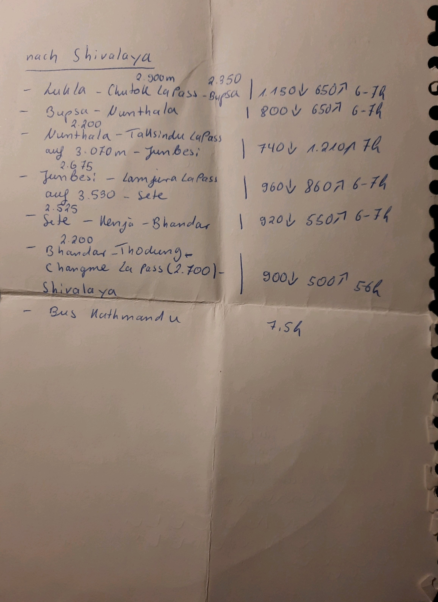

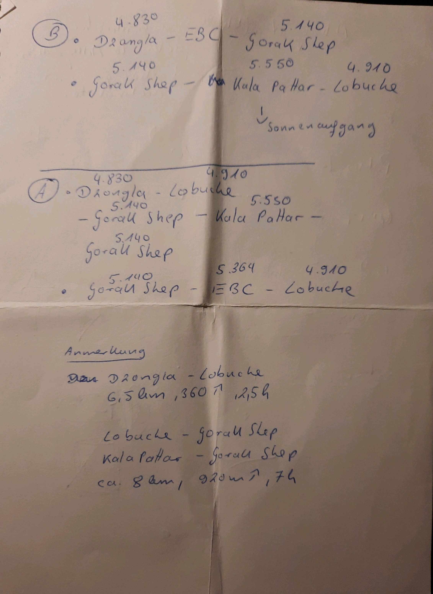

Am ersten Tag starten wir unsere Wanderung um 12:42 Uhr in Lukla. Zu dieser Uhrzeit sind wir bereits 32 Stunden auf den Beinen, da wir um 1 Uhr nachts mit dem Bus von Kathmandu nach Remchhap gefahren sind. Die Busfahrt war überraschend angenehm, da wir überraschend etwas Schlaf gefunden haben und nur etwas übermüdet in Remchhap ankommen. In der Hochsaison gibt es nahezu keine direkten Flüge von Kathmandu nach Lukla. Die Flüge werden nach Remchhap ausgelagert, das ca. 120 km von Kathmandu entfernt liegt, was in Nepal eine vier- bis fünfstündige Busfahrt bedeutet. In Remchhap gehen die ersten Flüge gegen 7 Uhr. Unser Flug ist für 9:30 Uhr geplant. Gleich bei der Ankunft werden wir aber merken, dass es heute später werden wird. Dichter Hochnebel hängt im Tal der den Sichtflug der Flugzeuge unmöglich macht. Wir sind geduldig ungeduldig und hoffen auf Wetterbesserung und fürchten bereits am ersten Tag einen Tag zu verlieren und vergessen, dass es noch wirklich früh am Morgen ist und die Sonne erst in wenigen Stunden hinter den Bergen hervorschauen wird. Ein Guide zeigt sich zuversichtlich und gibt eine genaue Prognose wann wir einen ersten Fetzen des blauen Himmels sehen werden. Er wird recht behalten und recht schnell kündigt ein reges Treiben am Flugfeld an, dass bald die ersten Maschinen starten und landen werden. Tatsächlich starten und landen die Flugzeuge plötzlich im Minutentakt. Die Nervosität ob des eigenen Fluges steigt. Checkin, Gepäckkontrolle, Sicherheitskontrolle. Alles geht schnell, ist rudimentär und oberflächlich. Die Flugzeuge kommen und gehen. Laute Motorengeräusche kündigen den nächsten Start an und verkünden eine weitere erfolgreiche Landung. Hoffentlich ist auch die eigene Landung erfolgreich oben auf der kurzen zum Berg hin ansteigenden Landebahn in Lukla. 

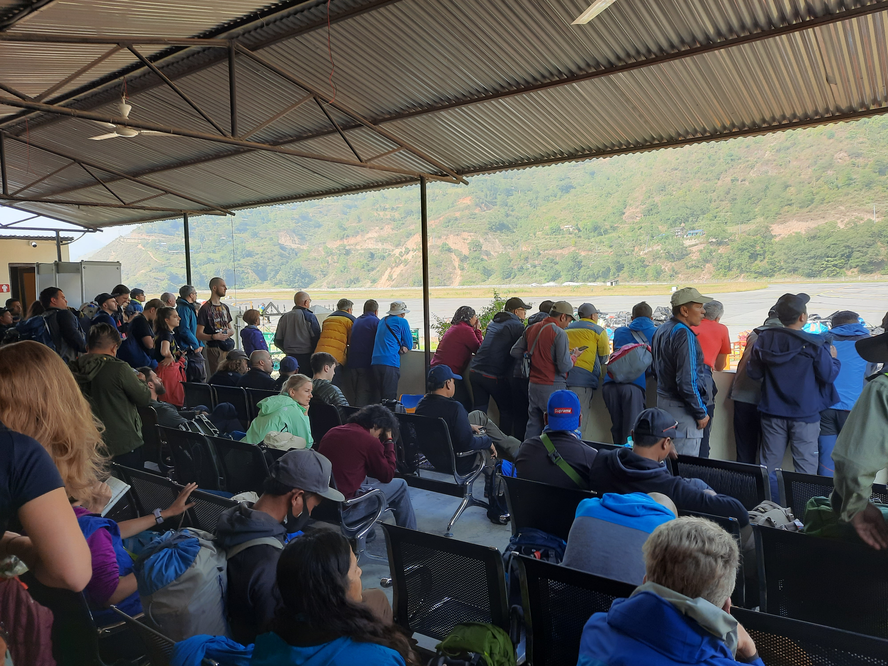

Der Start gelingt. Die erste Rechtskurve gelingt. Die folgende Linkskurve auch. Das Flugzeug gewinnt an Höhe. Wir schauen auf Berge mit grünen Bäumen und staubigen Pisten, welche die vielen Siedlungen verbinden, die wir sehen können. Wir sind gerade acht Minuten unterwegs als die Piloten die Geschwindigkeit reduzieren. Wir sehen weiße Berge. Ich sehe beim Blick nach vorne durch den Gang die Instrumente der Piloten. Die Instrumente sehen zu können beruhigt mich in meiner Nervosität. Das Flugwetter ist gut. Es gibt einige Wackler, wenn wir die Berge in geringer Höhe überfliegen. Ich sehe ein Flugzeug etwas niedriger an uns vorbei schießen - das Flugzeug vor uns im Landeanflug. Unser Landeanflug beginnt unmittelbar danach. Ich sehe Lukla. Ich sehe die Piste bevor der Pilote eine letzte Rechtskurve macht. Die Piste ist deutlich länger wie ich es mir vorgestellt habe. Es ist ein steiler Anflug, deutlich steiler als ein Anflug einer Verkehrsmaschine. Die Piloten ziehen den Vorhang zu. Trotzdem kann ich durch einen Schlitz die Landebahn vor uns sehen. Ich weiß der Anflug gelingt. Das Flugzeug setzt sanft auf und bremst sanft ab. Es ist geschafft. Wir sind in Lukla. Die Wanderung kann beginnen.

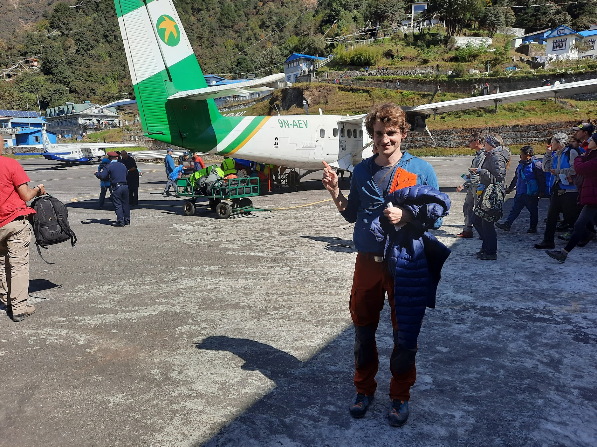

Lukla ist das Tor zum Sagarmatha-Nationalpark. Ein Flughafen und ein Helikopter Port führen dazu, dass die meisten Touristen nach Lukla fliegen und ihre Wanderung hier beginnen. Später werden wir herausfinden, dass in der Hochsaison (April, Oktober und November) bis zu 5000 Touristen den Park pro Monat besuchen. Der eigentliche Eingang zum Park ist noch eine Tageswanderung entfernt und auch unser Ziel unserer heutigen ersten Etappe. Lukla liegt auf 2800 Meter über dem Meeresspiegel. Wir können Schneeriesen sehen. Die Landschaft bietet noch einen weiten Blick über die Täler. Die Richtung unserer Wanderung ist klar zu erkennen. In Lukla gibt es noch einmal alles was man brauchen könnte. Wir kaufen Klopapier für 150 Rupies und gehen an den Läden, den ATMs und Unterkünften vorbei und kehren bei Dali Sherpa ein. Dali Sherpa betreibt eine Unterkunft und eine Küche. Uns sagt es zu, weil es gut, aber nicht zu gut aussieht und Dali uns einfach sympathisch ist. Wir essen Dal Bhat und trinken Tee. Erst ist es nur Reis, doch dann zaubert Dali immer mehr Curry, Prinkels und Gemüse hervor. Das ganze essen wir mit einem Nachschlag den es nur bei Dal Bhat gibt und geradezu obligatorisch ist. Nach dem Essen machen wir uns auf den Weg. Es sind viele Gruppen, Träger und Tiere unterwegs. Es fliegen viele Helikopter. Wir vermuten, dass es sich einerseits um Flüge zum Mount Everest handelt und andererseits um Flüge um höhenkranke Touristen auszufliegen. Die Everest Region scheint dafür berüchtigt zu sein, dass Touristen schnell ausgeflogen werden - die Versicherung zahlt, der Rückweg fällt weg und der Everest ist gesehen. Irritierend ist ebenfalls der Irish Pub in Phadking, dem nächsten großen Ort nach Lukla. Interessant sind die italienischen Espressomaschinen. Viele verbringen die erste Nacht in Phadking. Wir möchten weiter nach Monjo. Am Anfang sind wir glücklich über weniger Menschen auf dem Trek nach Monjo. Am Ende sind wir doch erschöpft nach der kurzen Nacht. Wir laufen nach Monjo und steigen in einem Gasthaus ab. Es sind viele andere Touristen im Gasthaus. Es gibt zwei große andere Gruppen. Es gibt wieder Dal Bhat, Knoblauchsuppe und Tee zum Abendessen. Wir sind erst nicht glücklich über unser Zimmer, weil die Fenster undicht sind und es in den Zimmern sehr kühl ist. Es hätte viele andere Gasthäuser gegeben und fast alle Gasthäuser sehen besser aus als was ich 2017 auf dem Manaslu Trek gesehen habe. Trotzdem ist es gut bei den Unterkünften wählerisch zu sein. Der Preis einer Unterkunft ist im ganzen Nationalpark gleich: 500 Rupies pro Nacht. Manchmal wird der Preis allerdings pro Zimmer und manchmal pro Person berechnet. Manchmal wird ein höherer Preis verlangt, wenn das Zimmer über eine Dusche verfügt oder es Strom zum Laden der Handys gibt. Für Frühstück, Mittagessen und Abendessen zahlen wir zwischen 1000 und 2500 Rupies für zwei Personen. Auf dem Weg nach Monjo kommen wir nicht nur an vielen Gasthäusern vorbei, sondern auch an einer Schule und einem Krankenhaus. Ich finde es gut, dass es so gut aussieht, weil es nicht nur den Touristen, sondern auch den Einheimischen hilft. 

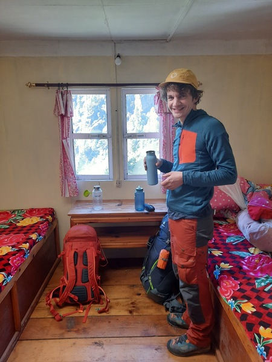

Am zweiten Tag laufen wir von Monjo nach Namche. Wir verlassen den Weg und gehen zu einem schönen Kloster. Zurück auf dem Weg müssen wir durch einen Checkpoint und den Eintritt für den Nationalpark bezahlen. Es herrscht ein Gewusel aus Touristen, Guides, Träger und Tiere. Wir zahlen den Eintritt gerne, da wir positiv von den Möglichkeiten überrascht sind auf dem Weg Müll wegwerfen zu können und eine öffentliche Toilette besuchen zu können. Ich will alles wieder mit ins Tal nehmen, das ich in den Park gebracht habe. Ich merke aber, dass das Müllmanagement im Sagarmatha-Nationalpark besser als in der Manaslu Conservation Area ist. Schon vor Monjo war das Tal eng, aber mit dem Zutritt zum Nationalpark wird die Landschaft noch einmal schöner. Ein wilder Fluss fließt reißend durch das enge Tal. Wir laufen mehrmals über Brücken über den Fluss in mitunter luftigen Höhen. Wir kommen langsam zum Anstieg nach Namche mit einem Anstieg über 600 Höhenmeter. Auch auf knapp 3000 Meter über dem Meer ist dieser Anstieg für uns kein Problem. Es bleibt trotzdem keine Luft, aber David hat zu uns ohnehin gesagt "no talking while walking". Wir erreichen Namche und merken, dass Namche sehr entwickelt ist. Wir freuen uns trotzdem sehr darüber angekommen zu sein und suchen uns eine Lodge um zwei Tage in Namche zu verbringen. In Namche gibt es alles - es gibt einen North Face Laden, einen Sherpha Laden, diverse kleine Supermärkte und den obligatorischen Irish Pub. Es gibt Apotheken und Läden die Ausrüstung verkaufen und sich nicht vor einem deutschen Ausrüstungsgeschäft verstecken müssen. Wir spazieren durch Namche, sind verzaubert von den kleinen Kühen, schauen beim Volleyballspiel zu und kehren beglückt zur Unterkunft zurück. 

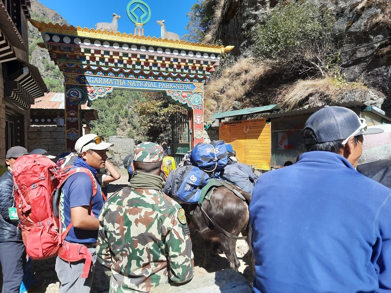

In Namche legen wir einen Akklimatisierungstag ein. Am freien Tag kann ich nicht mehr widerstehen und bitte unseren Gastgeber mir auf der großen italienischen Espressomaschine einen Cappuccino zuzubereiten. Schon am Abend zuvor haben wir beobachtet wie fürsorglich die Maschine gepflegt und behandelt wird. Der Cappuccino schmeckt in Namche genau so gut wie in Kathmandu - kräftig mit einer fettigen Milch und einem Kaffee mit einer milden und zurückhaltenden Note. Ich frage mich woher die Maschine kommt und wie sie den Weg nach Namche gefunden hat. So weit oben und so weit entfernt sollte nichts selbstverständlich sein und doch schätzt man die überraschenden Annehmlichkeiten. Am heutigen Ruhetag haben wir nur eine kleine Wanderung mit leichtem Gepäck in die Orte Khumjung und Khunde geplant. Die zwei Orte liegen oberhalb von Namche auf ca. 3800m. David hatte uns abgeraten zu viel zu unternehmen, da "activity a contributing factor of high altitude sickness" ist. In den beiden Dörfern gibt es ein Krankenhaus und eine Schule der Hillary Stiftung. Die Dörfer sind schön. Beide Dörfer haben ein eigenes Kloster. Es gibt schöne Tiere und mit Steinmauern begrenzte Äcker und Gärten. Nachdem die Dörfer abseits der Hauptwanderwegen liegen verirren sich nicht ganz so viele Touristen in die beiden Dörfer, wodurch ein zurückhaltender Tourismus in den Dörfern existiert. Es gibt vereinzelte Unterkünfte. Es gibt vereinzelte Restaurants. Zum ersten Mal auf der Wanderung sehen wir Dörfer in einem ursprünglichen Zustand. Wir nehmen uns die Zeit das Krankenhaus genauer anzuschauen und sind glücklich über unsere Entscheidung die Wanderung unternommen zu haben. Wir wissen zu diesem Zeitpunkt noch nicht, dass die nächsten Tage und auch die folgende Wanderung sehr schwierig wird, wodurch der Ausflug in die Dörfer ein letzter Moment von unbeschwerter Freiheit sein werden. 

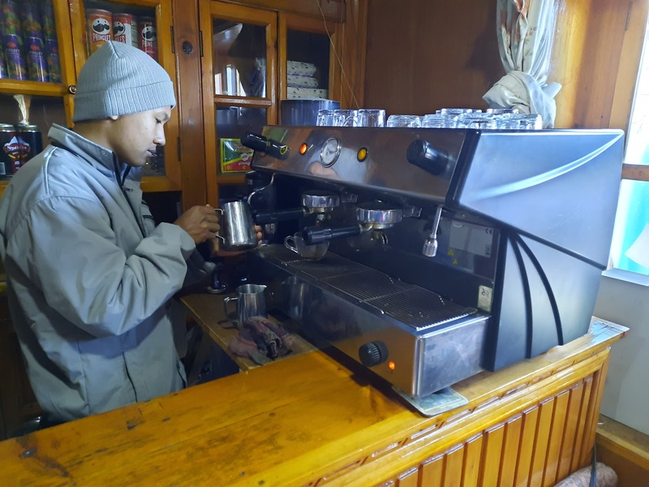

In der folgenden Nacht geht es rapide mit meinem Gesundheitszustand bergab. Ich bin urplötzlich und ohne Vorwarnung krank geworden. Es beginnt mit einem Sturm in meinen Nasennebenhöhlen. Ich verbringe die zweite Nachthälfte mit Kopfschmerze und Stöhnen und mir ist klar, dass ich die Wanderung nicht weiter vorsetzen kann. In den frühen Morgenstunden muss ich Schmerzmittel nehmen. Am frühen Vormittag entscheiden wir uns doch die Wanderung fortzusetzen. Unser heutiges Etappenziel ist das kleine Dorf Thame auf 3900m. Wir schaffen es nur bis Thamo, wo wir die nächsten beiden Tage verbringen werde. Ich verbringe die Tage und Nächte überwiegend in Bett und kämpfe mit Kopfschmerzen, Schnupfen, Husten, Fieber und Schüttelfrost. Nach zwei Tagen geht es mir etwas besser. Wir versuchen bis Thame zu laufen und schaffen es auch anzukommen, um aber gleichzeitig zu merken, dass ich körperlich nicht in der Lage bin meinen eigenen Rucksack zu tragen. Die Eintönigkeit in den Tagen zuvor muss für meine Begleiterin belastend gewesen sein. Es ist auch belastend zu merken, dass die wenigen Tage Auszeit immer noch nicht ausgereicht haben um die Krankheit zu kurieren. Wir verbringen weitere Tage und Nächte in Thame und merken, dass eine Atemwegserkrankung auf etwa 4000 Höhenmeter kein Spaß ist. Der physische Zustand mag sich verbessern, die psychische Verfassung nimmt stetig ab. Nach zwei Tagen ist mein Zustand besser, aber immer noch weit entfernt von gesund. Ich finde es anspruchsvoll nett zueinander zu bleiben und merke wie wichtig Davids wichtigste Regel ist. Dennoch ist es physisch und psychisch es unvorstellbar wenige Tage später den Renjo La Pass nach Gokyo zu gehen. Es wäre unsere erste Passüberquerung mit 7 Stunden Gehzeit, steilen 1100 Höhenmeter Anstieg und einem Pass auf etwa 5400 Höhenmeter gewesen. Wir entscheiden uns gegen die Passüberquerung und kehren nach Namche zurück. Wir wollen durch das Tal nach Gokyo. Das Laufen soll uns helfen wieder Selbstvertrauen zu gewinnen und uns physisch und psychisch zu erholen. Wir laufen an diesem Tag bis in den kleinen Ort Monjo mit einer wunderschönen Aussicht und einer der besten Unterkünfte auf unserem Trek. 

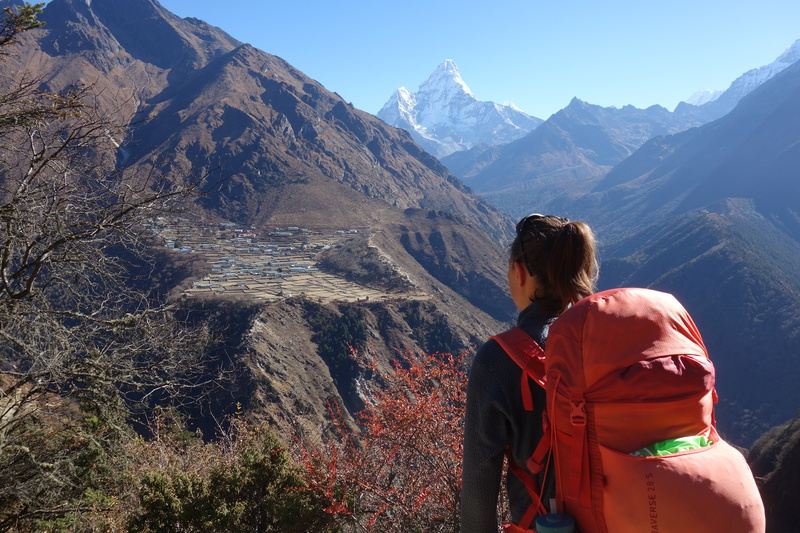

Wir laufen über Monjo nach Machermo mit dem Ziel Gokyo. Vielleicht können wir die schlechten Tage hinter uns lassen und mit Ausnahme des Renjo La Passes unsere Wanderung wie geplant fortsetzen. In Machermo ist aber die Kacke wieder einmal am Dampfen. Wir sitzen am mit Yak Dung gefüllten Ofen. Der Ofen erfüllt den Raum mit einer angenehmen Wärme. Schon gestern haben wir in Monjo den Ofen und jeweils eine Wärmflasche genossen. Monjo ist wohl aufgrund seiner exponierten Lage berühmt berüchtigt für kalte Temperaturen. Wie gut, dass es in Monjo Wärmflaschen gab. In Machermo gibt es leider keine Wärmflaschen mehr. Noch gestern ist uns der Aufenthalt in der warmen Lode wie ein Wunder vorgekommen. Es liegen schwierige Tage hinter uns. Im Krankheitsfieber in Thame habe ich angekündigt den Renjo La Pass nicht mehr laufen zu können, um am nächsten Tag wieder fest davon auszugehen den Renjo La Pass laufen zu können. Spätestens mit der Genesung und nach der Entscheidung den Umweg zu laufen frage ich mich, ob ich den Renjo La Pass nicht doch hätte laufen können. Angesichts der Tatsache, dass wir kurz davor waren mich ausfliegen zu lassen und ein etwas weniger kranker Franzose aus einer Reisegruppe ausgeflogen wurde, wäre es ein sehr tollkühnes Unterfangen geworden kurz nach einer Grippe einen Pass auf 5400 Höhenmeter mit über 1100 Höhenmeter Steigung bezwingen zu wollen. Wir sollten den Pass nicht bezwingen und es ist nur logisch nach einer schweren Erkrankung nicht einfach das Programm weiter abspulen zu können. Also sind wir nach Namche zurückgekehrt und haben erst in Namche in einem Café entschieden nach Gokyo über das Tal anstatt über den Pass zu laufen. Die Entscheidung war keineswegs einfach, da die Tage der Krankheit nicht nur körperlich, sondern auch mental seine Spuren hinterlassen haben. Wenn man vermeintlich nur schlechtes erlebt hat, dann fehlt es an Selbstvertrauen und man stellt sich die Frage was man hier macht. Im Himalaya in den langen Stunden der Kälte in der Nacht ist es schwierig das Schlechte hinter sich zu lassen und wieder das Gute zu sehen. Aber manchmal reich einfach ein Café, ein warmer Ofen und eine warme Wärmflasche und etwas Mut und Zuversicht um es noch einmal versuchen weiter zu machen. 

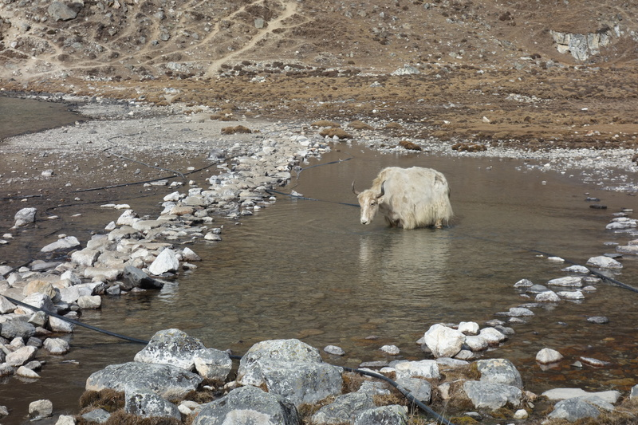

Inzwischen sind wir in Gokyo angekommen, aber die Krankheit lässt uns nicht los. Die Nasennebenhöhlen sind entzündet. Ich nehme Antibiotika. Glücklicherweise haben wir Antibiotika dabei. Wir haben uns entschieden abzusteigen und die hohen Berge für diese Reise hinter uns zu lassen. Wir wollen morgen nach Namche laufen, am Folgetag nach Lukla, um am dritten Tag das Flugzeug ins Tal zu nehmen. 


<iframe src="https://www.komoot.de/tour/975958664/embed?profile=1" width="100%" height="700" frameborder="0" scrolling="no"></iframe>



<iframe src="https://www.komoot.de/tour/975958667/embed?profile=1" width="100%" height="700" frameborder="0" scrolling="no"></iframe>



<iframe src="https://www.komoot.de/tour/975958684/embed?profile=1" width="100%" height="700" frameborder="0" scrolling="no"></iframe>



<iframe src="https://www.komoot.de/tour/975958688/embed?profile=1" width="100%" height="700" frameborder="0" scrolling="no"></iframe>



<iframe src="https://www.komoot.de/tour/975958705/embed?profile=1" width="100%" height="700" frameborder="0" scrolling="no"></iframe>



<iframe src="https://www.komoot.de/tour/985367796/embed?profile=1" width="100%" height="700" frameborder="0" scrolling="no"></iframe>

