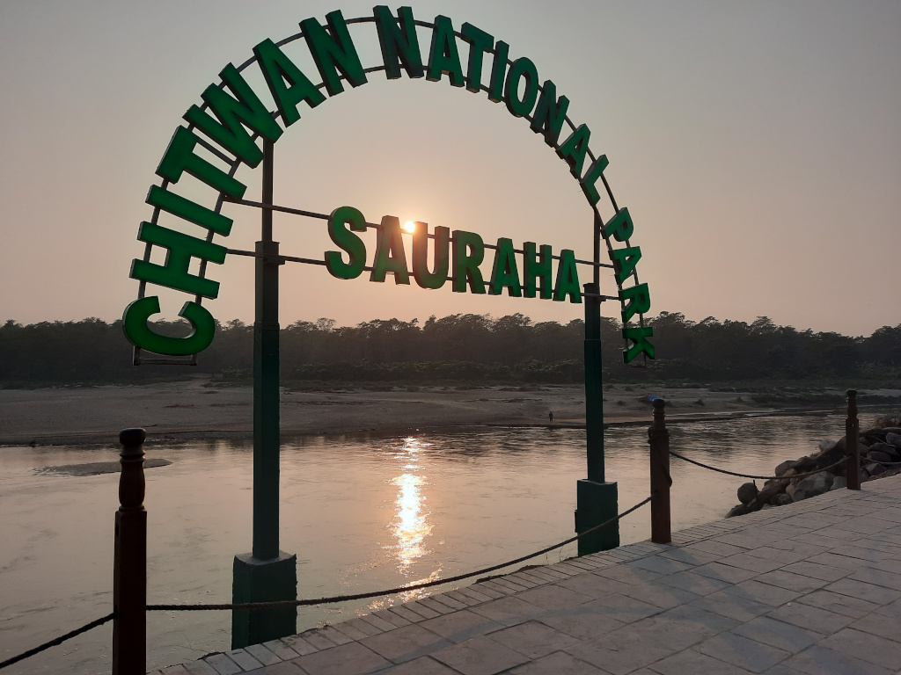
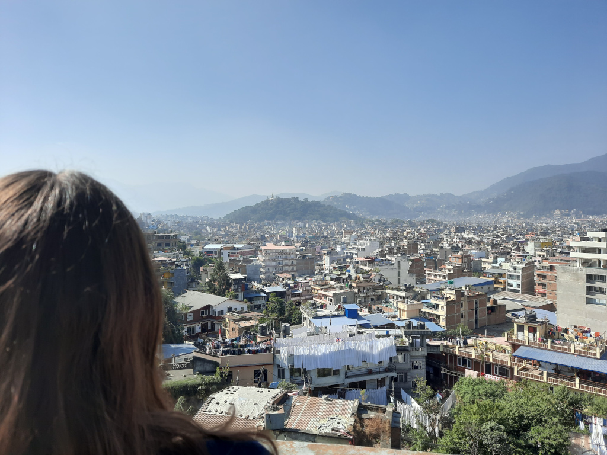
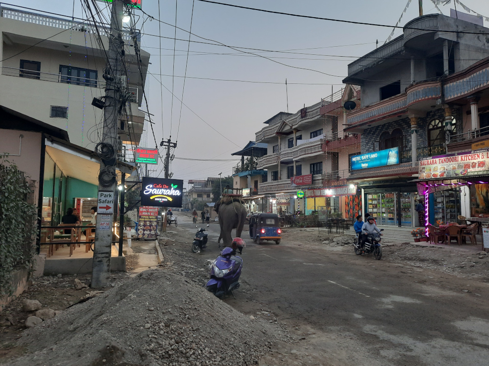
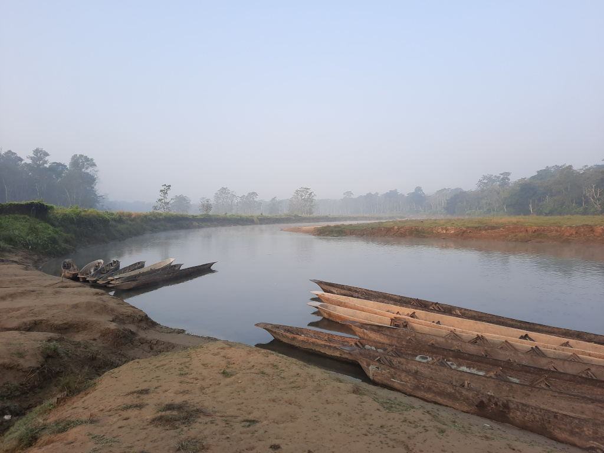
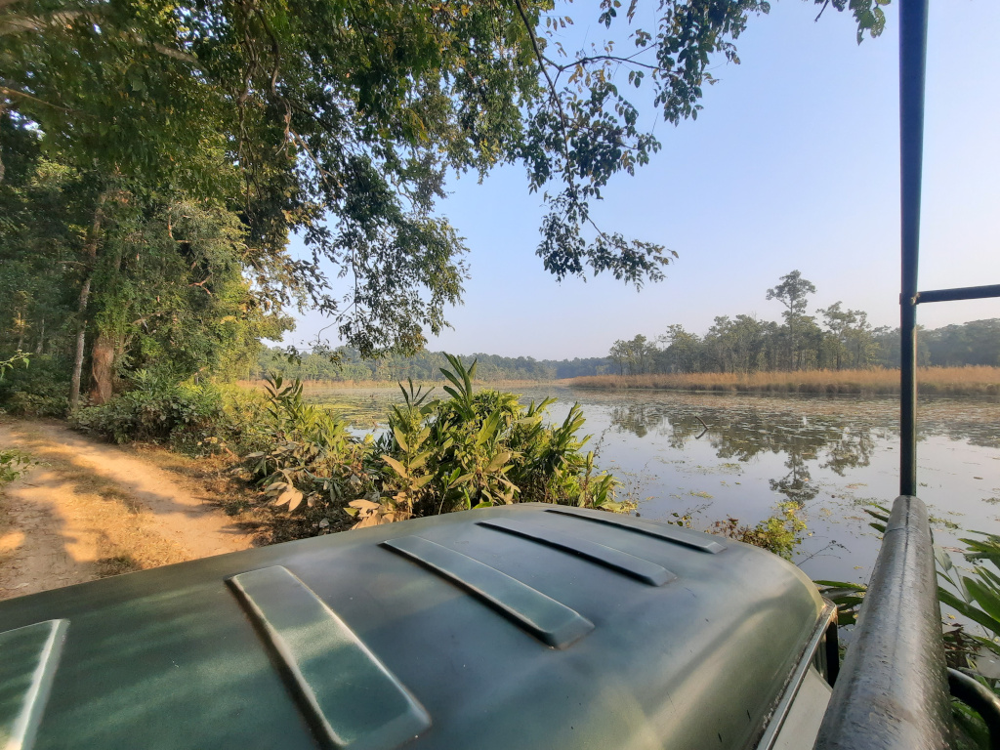
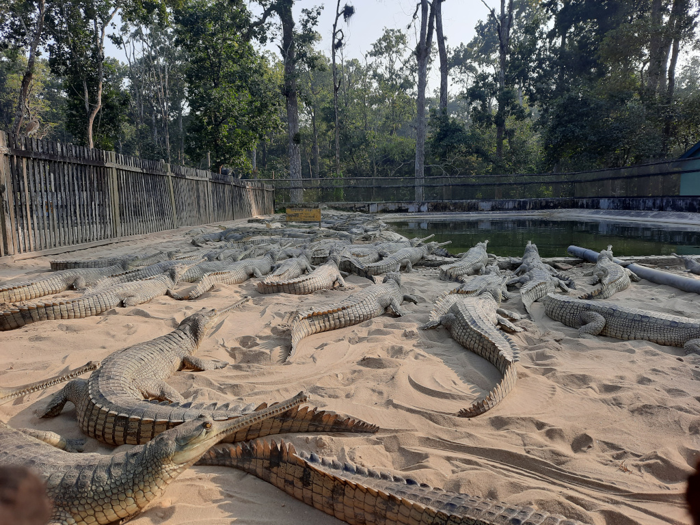

+++
author = "Johannes Ehm"
title = "Enjoying Nepal"
date = "2022-12-26"
description = ""
tags = [
	"trekking",
	"wandern",
	"deutsch"
]
draft = false
+++

“Rhino, rhino, the rhino is here” schallt es aus dem Garten. Wir liegen bereits unter dem Moskitonetz im Bett. Wir springen auf und müssen uns sammeln. Ich muss mich sammeln. Meine Partnerin ist bereits im Garten. “The rhino is here. Why does he take so long?” ruft es aus dem Garten. Ich muss mich sammeln. Ich versuche mein Foto zu finden, gebe auf und springe in den Garten wo ich ein Einhorn sehe wie es durch die Gartenanlage flitzt. Ein graues Einhorn, mehrere Tonnen schwer, aber doch mit seinem schweren Körper flott unterwegs. Es sind nicht mehr als 10 Meter die uns von dem Einhorn trennen, als es vor uns von links nach rechts an uns vorbei düst. Es ist ein majestätisches schönes Tier wie ich es noch nicht gesehen habe. Es ist aber auch ein angsteinflößender Anblick. Ich denke mir, dass ich diesem Einhorn nicht im Weg stehen möchte. Das Einhorn wird von drei Nepalesen verfolgt die Springen, Schreien und das Einhorn mit Steinen bewerfen. Wir sind im Chitwan-Nationalpark im Süden von Nepal. 

Nach unserer abgebrochenen Wanderung im Sagarmatha-Nationalpark sind wir nach Kathmandu zurückgekehrt. Mit dem Flugzeug ging es von Lukla nach Remechhap und mit dem Bus von Remecchap nach Kathmandu. Wir haben uns sehr auf unsere Unterkunft in Kathmandu gefreut, aber waren auch aufgrund den ungeplanten knapp 1,5 Wochen angespannt. Abgekämpft von der Wanderung und meiner Erkrankung wollten wir einfach zurück und uns entspannen. Wir haben uns traurig und etwas gedemütigt gefühlt. Im Bus von Rechchap nach Kathmandu werden die Heldengeschichten der zurückliegenden Tage erzählt - wir sind aber gescheitert. Zu Scheitern ist uns noch nicht passiert - egal ob Europa, Asien und Südamerika. Die Busfahrt von Remechhap nach Kathmandu zieht sich. In den Vororten von Kathmandu sind die Straßen voll. Es ist Berufsverkehr. Immer wieder ziehen Gruppen an uns vorbei um für eine Partei in den [kommenden Wahlen](https://www.tagesschau.de/ausland/asien/wahlen-nepal-parlament-101.html) Stimmung zu machen. Es ist etwas bizarr auf den Plakaten immer wieder [Hammer und Sichel](https://de.wikipedia.org/wiki/Nepalesische_Kommunistische_Partei) sowie [Hakenkreuze](https://de.wikipedia.org/wiki/Swastika) zu sehen. Die Neugier wächst und die Faszination ist zurück. Willkommen zurück in Kathmandu, Nepal.



In Kathmandu genießen wir unsere Unterkunft und die Spaziergänge durch Thamel. Es hat sich nicht viel verändert seit wir Kathmandu für unsere Wanderung verlassen haben. Die Restaurants und die Läden sind die gleichen. An einer Ecke werden weiterhin fleißig Drogen angeboten. An der nächsten Ecke warten die Taxifahrer auf ein gutes Geschäft. Wir besuchen unsere Lieblingsplätze aus der ersten Woche. In einem Café erinnert sich die Bedienung, dass ich doch der Deutsche sei der aussieht wie Thomas Müller, dem Fußballer des FC Bayern. In einem anderen Café ist der Cappuchino immer noch gut und günstig. Und im [Pilgrims Book House](https://www.pilgrimsonlineshop.com/) gibt es immer noch viele interessante Bücher wie man sie in einer Deutschen Buchhandlung nicht finden würde. Hinter jeder Ecke entdecken wir auch etwas neues, sei es ein schöner Innenhof, ein Restaurant mit leckeren Essen oder eine Dachterrasse mit fantastischen Blick über Kathmandu. Wir fangen an auch Pizza und Burger zu essen und gleichzeitig nicht auf das tägliche Paneer Gericht zu verzichten. Ein Kochkurs versetzt uns in die Lage selber Dal Bhat und Masala Tea zu kochen. Zufällig treffen wir Wanderer wieder. Es ist toll sich über die vergangene Wanderung, die entdeckten Ecken in Kathmandu und die vor uns liegenden Heimreise auszutauschen. Zugegeben, daheim ist zu diesem Zeitpunkt in Kathmandu noch sehr weit weg. Aber der Moment mit dem wir wieder nach Hause katapultiert werden wird kommen.

Ein Ausflug führt uns in den Westen der Stadt. Am Fluss Bagmati liegt der Tempel Pashupatinath der zum Weltkulturerbe gehört. Der Tempel ist ein Heiligtum und eine Grabstätte der Hinduisten. Von der gegenüberliegenden Seite des Flusses auf Tribünen aus Stein können Besucher den Zeremonien zuschauen. Die Angehörigen der Verstorbenen bringen die menschlichen Überreste ihrer Verstorbenen auf Liegen aus Metal. Die Verstorbenen sind in schönen orangenen Tüchern eingewickelt und werden mit orangenen Blumen geschmückt. Es werden die Füße des Verstorbenen gewaschen und der Leichnam wird gesegnet. Die Angehörigen verabschieden sich wobei gerade die Frauen den Tod lautstark beklagen. Die öffentliche Aussegnung und Verbrennung der Verstorbenen wirkt auf uns befremdlich, vermittelt aber durch die Abwesenheit einer formalen Lithurgie, durch die Rituale, Klagen und Hingabe der Angehörigen auch Ehrfurcht und Respekt vor dem verstorbenen Menschen und das Leid seiner Angehörigen. An diesem Nachmittag während unseres Besuches werden sechs Menschen betrauert. Die Überreste werden verbrannt. Die Asche im Fluss Bamati verstreut. Die verstorbenen Menschen werden Teil eines ewigen Kreislaufes und der Tod wird in Pashupatinath zu dem was er ist - zum Teil des Lebens und er vermittelt uns ein Gefühl von Ehrfurcht das Leben und diesen stillen Moment in Kathmandu zu schätzen.



Unsere Busfahrt in den Chitwan Nationalpark führt uns in den Ort Sauraha. Sauraha ist wohl der wichtigste Ort für Touristen am Chitwan Nationalpark. Viele Unterkünfte werben an der Busstation um die ankommenden Reisenden. Viele Büros werben für Ausflüge in den Nationalpark. Wir lehnen alle Angebote ab und versuchen zu Fuß Orientierung zu finden und vom Busbahnhof im Nirgendwo einen Weg zur zentralen Hotelstraße zu finden. Ich bin spürbar genervt davon, dass die Busfahrt im Nirgendwo endet und dass einem nichts einfach gemacht wird. Scheinbar habe ich zu diesem Zeitpunkt von Taxifahrern schon lange genug, die sich auf einen stürzen, wenn man gerade eine fünfstündige Busfahrt hinter sich hat. Nein, ich hatte schon immer genug von Taxifahrern die sich auf einen stürzen egal in welchem Land, wobei es in Sauraha eigentlich keinen Grund sein so genervt zu sein und es unangenehm sein muss mit so einem fast grundlos genervten Reisenden unterwegs zu sein. Uns begrüßen schöne Häuser, schöne Gärten, schöne Felder und eine angenehme Wärme. Wir kommen an zwei Schulen vorbei. Die Kinder springen auf der Straße umher und ich bin genervt. Ich weiß nicht genau wo wir sind - mein GPS im Smartphone ist kaputt. Als wir die Hotelstraße finden bin ich etwas entspannter und wünsche mir ein Mittagessen mit Cola und Paneer. Ich glaube, dass ich nach dem Mittagessen entspannter sein sollte und ich bin mir sicher, dass Sauraha und der Chitwan Nationalpark seinen Anteil daran hatte, dass ich bis zum Ende des Aufenthalts immer entspannter werde. Nach dem Mittagessen werden wir immer wieder auf eine Unterkunft angesprochen. Wir lehnen alle Angebote ab und suchen eine Unterkunft mit Pool auf - zu teuer. Wir gehen zurück zur Unterkunft mit dem netten Herrn der uns verkündet, dass wir ein oder zwei Tage bleiben können, aber weil es so schön und der nette Herr so nett ist checken wir ein und finden in der Traveller Jungle Camp Lodge unser Zuhause für die nächsten Tage.

Am zweiten Tag unseres Aufenhalts in Sauraha am Rande des Chitwan Nationalparks unternehmen wir einen Ausflug mit dem Boot in die Randzone des Nationalparks und ein Ausflug mit dem Jeep in den Nationalpark. Der Ausflug mit dem Boot am Morgen ist wunderschön. Wir sind überwältigt von der Vielzahl von Vögeln die am Morgen am Fluss unterwegs sind. Wir sind 30 Minuten mit dem Boot unterwegs. Unser Guide kann uns immer wieder auf Vögel am Fluss hinweisen. Wir sehen und hören Eisvögel, Trappen und Störche und wir sehen Krokodile die im Fluss auf eine Mahlzeit lauern. Als uns der Guide die Höhlen zeigt in dem sich die Krokodile zurückziehen hält er seinen Knüppel etwas fester und etwas mehr bereit. Zum Glück hat uns der Guide zum Beginn der Tour versichert, dass uns nichts passieren wird, dass der Guide und seinem zweiten nepalesischen Begleiter schon alles passiert ist und schon erfolgreich Angriffe von wilden Tieren abgewehrt wurden. Am Ende der Flussfahrt gehen wir noch zu Fuß durch die Randzone des Nationalparks und sehen ein schlafendes Einhorn mit Jungtier. Wir nähern uns den schlafenden Einhörnern auf ca. 100m. Es ist sicher nicht ungefährlich sich so nah einer Einhornmutter mit Jungtier zu nähern. Vielleicht schlägt auch deswegen der Guide relativ schnell vor wieder zu gehen. Der Nationalpark ist schön und besteht in der Randzone aus Wald und Seen. Wir sind gespannt auf unseren Ausflug mit dem Jeep in den eigentlichen Nationalpark. Nach der Wanderung durch die Randzone dürfen wir noch das sogenannte Elephant Breeding Center besuchen in dem Elefanten gezüchtet werden. Es ist bedrückend den angeketteten Elefanten zuzusehen. Es mag einen Sinn haben ein Elefant Breeding Center zu haben. Trotzdem schmerzt der Anblick von Tieren in Ketten.

Am Nachmittag des zweiten Tages unternehmen wir einen Ausflug mit dem Jeep in die Kernzone des Nationalparks. Wir sind überraschend lange unterwegs und lassen uns von der unnachahmlichen Energie des Guides anstecken möglichst viele wilde Tiere im Wald und in der Steppe zu entdecken. Der Wald ist dicht und das Gras ist hoch. Keine guten Vorraussetzungen einen Tiger zu finden. Trotzdem hält jeder Tourist ausschau um ein Tier zu entdecken. Wir entdecken Affen, Rehe, Wildschweine, Vögel und ein Einhorn. Der Jeep macht lärm und warnt jedes wilde Tier meilen bevor wir das Tier entdecken können. Besser wäre es selbstverständlich zu Fuß unterwegs zu sein. Wir wären gerne Abenteurer - im Chitwan Nationalpark sind wir aber durch und durch Touristen. Plötzlich meint der Guide etwas Besonderes im Augenwinkel gesichtet zu haben. Das Fahrzeug wird abgestellt und wir warten. Wir warten sehr lange. Fast 30 Minuten versuchen wir das besondere wilde Tier auf dem Weg oder im Wald zu entdecken. Die Wartezeit gibt uns die Gelegenheit nicht nur zu sehen, sondern auch zu hören. Es ist still, aber niemals ganz still. Immer wieder sind Geräusche abseits der Wege zu hören. Die Blätter rascheln und die Bäume wiegen sich im Wind. Es ist eine schöne Stille die unterbrochen wird als sich andere Jeeps mit Touristen uns nähern. Wir fahren selber los und just als wir losfahren wird wieder ein Tier vermeintlich im Augenwinkel entdeckt. Der Jeep fährt zurück zum Ort wo wir schon vorher gewartet haben und wir warten und wir lauschen. An diesem Tag wird sich das geheimnisvolle Tier uns nicht mehr zeigen. Wir fahren weiter und fahren zum Crocodile Breeding Center wo weniger geheimnisvolle Tiere auf uns warten. Im Crocodile Breeding Center warten Käfige voller Krokodile. Wir erfahren, dass diese spezielle Art inzwischen ausgestorben wäre, wenn es das Crocodile Breeding Center nicht geben würde. Die Krokodile liegen zum größten Teil regungslos in den Käfigen. Es ist ein schräger Anblick so viele Krokodile zu sehen. Gegen Sonnenuntergang kommen wir wieder in Sauraha an.

Am vierten Tag müssen wir Sauraha verlassen. Wir wären gerne länger geblieben aber die Wahlen in Nepal lassen uns keine andere Möglichkeit. Mit den Wahlen werden die Grenzen zu Indien geschlossen, der Busverkehr wird eingestellt und die Restaurants größtenteils geschlossen. In den letzten Tagen in Kathmandu besuchen wir Yogastunden und üben uns im Atmen und Finden des inneren Friedens. Einen Tag nach den Wahlen besteigen wir das Flugzeug zurück nach Europa. Es war eine schöne beschwerliche Reise nach Nepal. Es wäre großartig gewesen, wenn wir unsere Wanderung geschafft hätten. Wir nehmen uns vor bald wiederzukehren und unsere Wanderung zu wiederholen egal ob wir in fünf, zehn oder fünfzehn Jahre zurückkehren. Es bleibt immer ein starker Eindruck die Menschen und die Natur Nepals zu besuchen und es gibt mir immer eine unvergleichliche Selbstgewissheit mein Leben in Europa zu meistern.