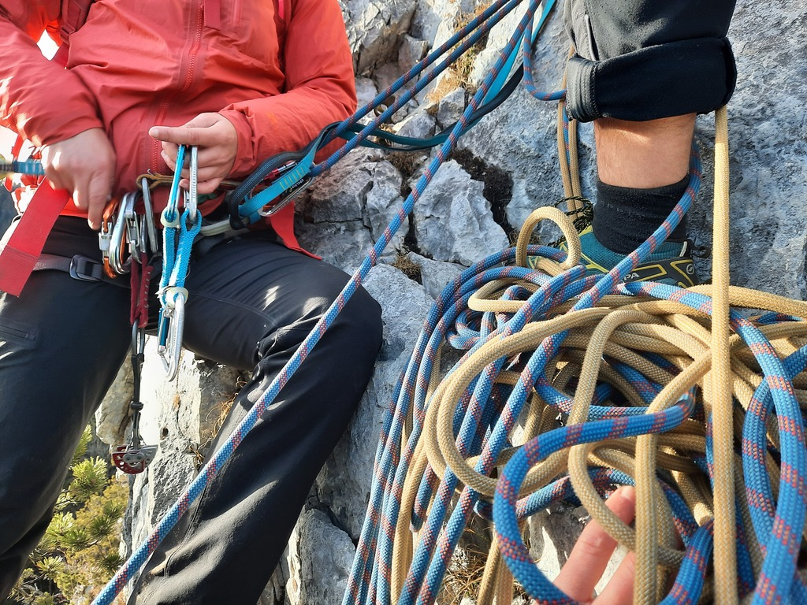
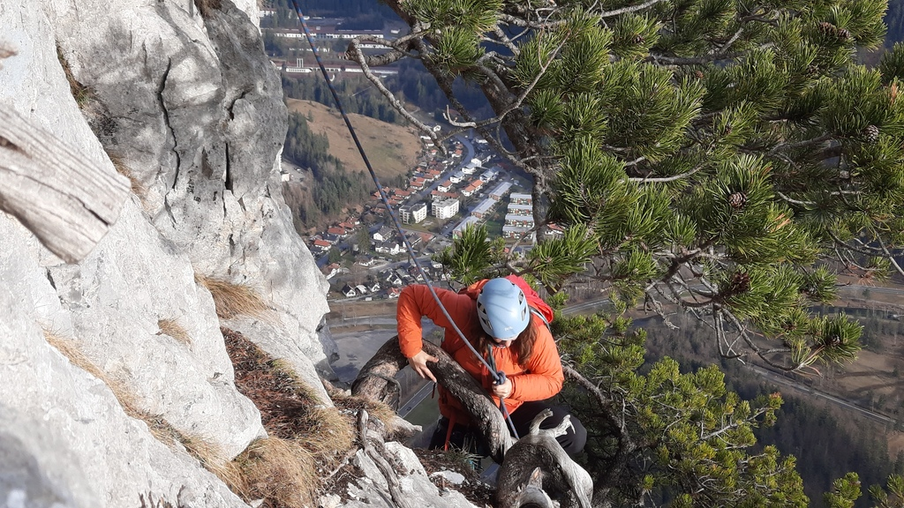
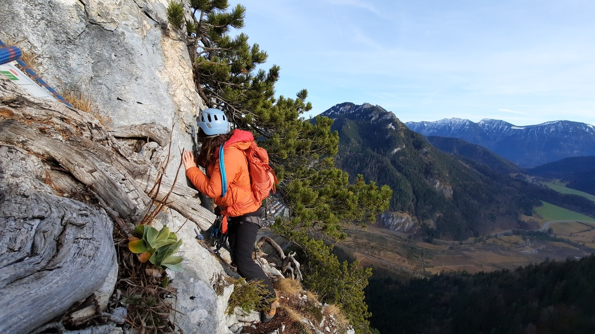
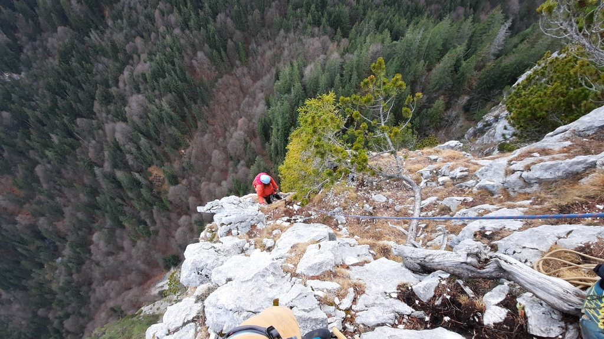

+++
author = "Johannes Ehm"
title = "Climbing the Linke Achsel"
date = "2023-01-25"
description = ""
tags = [
	"climbing",
	"klettern",
	"deutsch"
]
draft = false
+++

The mild temperatures of between christmas and new year eve 2022 did give us the unforseen opportunity to taggle a climbing project I did long hope to do: [the Linke Achsel](https://www.bergsteigen.com/touren/klettern/linke-achsel-kofelturm-kofel/) in Oberammergau. The Linke Achsel is a not so difficult climbing route to the Kofel, the famous local mountain of Oberammergau, the famous town in the Ammergauer Alps. The Kofel is the mountain where I did observe some climbers arriving at the top of the mountain and where I thought that multi pitching climbing could be interesting. While climbing a single pitch is relatively streight forward, climbing multi pitches requires lot more skills to climb securily. Fortunately, when you know somebody who has the required experience and which whom you can climb, learn and reach the top of the mountain. It is a furtune when your ideas become reality and when you become the climber which you did imagine you could be some years ago - it is even a bigger furtune when you can climb the kofel.

The Linke Achsel has a difficulty rating of 4- and provides many bolts to climb securily. However, the danger of rockfall is in my experience very high, even on the hiking trail towards the start of the climb. The climb is located above the hiking trail to the start of the climb. As the hiking trail is highly frequented, any climber should be very careful to avoid rock fall. During our climb a single rock was loosen and which did miss our stand only by a few meters.

Besides the danger of rock fall, climbing the Linke Achsel is not difficult, if one can manage outside routes of the difficulty rating 3.

