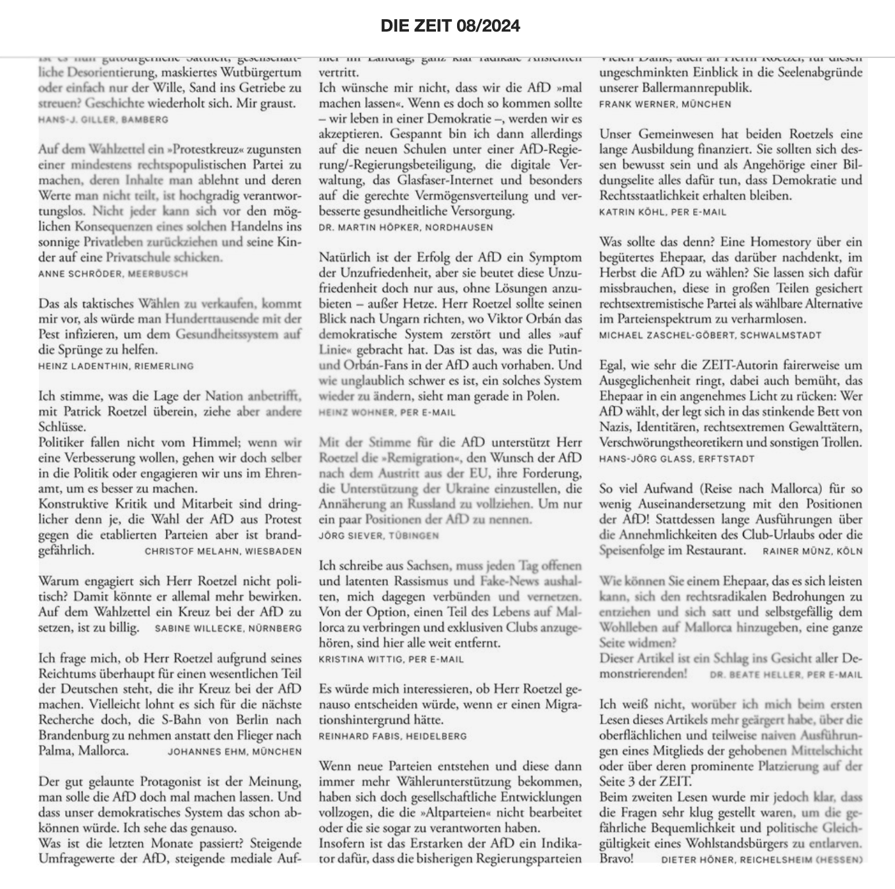

+++
author = "Johannes Ehm"
title = "Leserbrief"
date = "2022-10-04"
description = "Zeit Leserbrief"
tags = [
    "leserbrief",
    "german",
    "deutsch"
]
+++

Mein nachfolgender Leserbrief als Reaktion auf den Artikel ["Lasst sie mal machen"](https://www.zeit.de/2024/06/afd-waehler-landtagswahl-brandenburg-unzufriedenheit-politiker) erschienen in der ZEIT Ausgabe 05/2024 auf Seite 3 ist gekürzt veröffentlicht worden:

> Leserbrief zum Thema “Lasst sie mal machen” ZEIT Ausgabe 05/2024, Seite 3
>
> Sehr geehrte ZEIT Redaktion, sehr geehrte Frau Raether,
>
> selten hat mich in letzter Zeit ein ZEIT Artikel so irritiert wie das Porträt des möglichen AfD-Wählers Patrick Roetzel in der ZEIT Ausgabe 05/2024 auf Seite 3. Ich frage mich warum Herr Roetzel und seine Gedanken so prominent porträtiert werden, da seine Gedanken zur Wahlentscheidung, nach dem Motto irgendwas ist nicht gut - ich wähle die AfD, für einen Anwalt und einen ZEIT Leser erschreckend undifferenziert, unterkomplex, zusammenhangslos und widersprüchlich sind. Nachdem die Gedanken für eine Wahlentscheidung für die AfD allerdings immer erschreckend sind, frage ich mich, ob Herr Roetzel aufgrund seines Reichtums überhaupt für einen wesentlichen Teil der Deutschen Gesellschaft steht, die ihr Kreuz bei der AfD macht. Ich glaube nicht, gerade nachdem ich im Podcast Politikteil der ZEIT eine hervorragende Analyse gehört habe, warum die AfD so einen großen Zulauf hat. Vielleicht lohnt es sich für die nächste Recherche oder das nächste Porträt doch die nächste S-Bahn von Berlin nach Brandenburg  zu nehmen anstatt den Flieger nach Palma, Mallorca.
>
> Mit freundlichen Grüßen,
>
> Johannes Ehm,
> München

